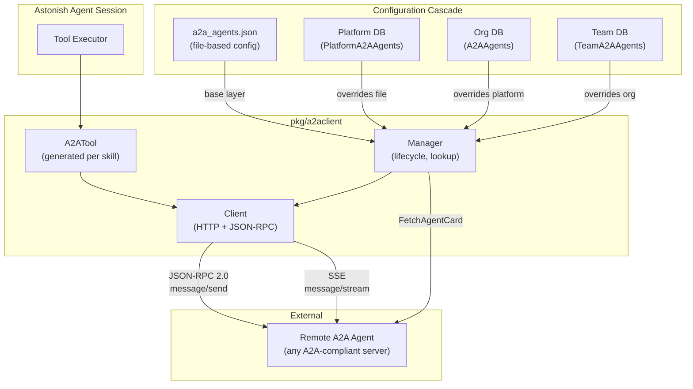

# A2A Client — Astonish Calling External Agents

> **Status:** Implemented  
> **Packages:** `pkg/a2aclient/`, `pkg/config/a2a_agents_config.go`, `pkg/store/a2a_agents.go`, `pkg/store/entstore/org_a2a_agents.go`, `pkg/store/entstore/team_a2a_agents.go`, `pkg/api/a2a_client_handlers.go`  
> **Schemas:** `ent/org/schema/org_a2a_agent.go`, `ent/team/schema/a2a_agent.go`  

## 1. Overview

The A2A Client feature enables Astonish to act as a **consumer** of external agents that implement the [Agent-to-Agent (A2A) protocol](https://github.com/a2aproject/a2a-go). Where the A2A *Server* feature (see [`a2a-server.md`](./a2a-server.md)) exposes Astonish as a remote agent for other systems to call, the A2A *Client* does the inverse: it connects **outward** to remote agents and surfaces their capabilities as callable tools within an Astonish session.

This mirrors the MCP Server integration pattern: remote agent connections are declared in configuration, scoped with a 3-tier cascade (Platform → Org → Team), and their skills are automatically converted into tools the Astonish agent can invoke.

### Key Capabilities

- **Agent Card discovery** — fetches `/.well-known/agent-card.json` from remote agents
- **Skill-to-tool mapping** — each skill advertised in the agent card becomes a callable tool
- **Credential-at-call-time** — authentication headers are resolved from the credential store at invocation time, never stored in config
- **Streaming** — supports SSE-based streaming via `message/stream`
- **Multi-tenant isolation** — credentials and agent configs are scoped per tier

## 2. Component Diagram



### Configuration Cascade (merge order)

```
a2a_agents.json  →  Platform DB  →  Org DB  →  Team DB
   (base layer)     (overrides)    (overrides)   (overrides — wins)
```

Lower tiers override higher tiers **by agent name**. The merge semantics are identical to the MCP Server cascade.

## 3. Configuration Cascade

### File-Based Config (Personal Mode)

Location: `~/.config/astonish/a2a_agents.json`

```json
{
  "a2aAgents": {
    "code-review-agent": {
      "url": "https://code-review.example.com",
      "credential_name": "code-review-token",
      "auth_type": "bearer",
      "timeout": "60s"
    },
    "translation-agent": {
      "url": "https://translate.internal:8080",
      "enabled": false
    }
  }
}
```

**Struct:** `config.A2AAgentFileConfig`

| Field | Type | Description |
|-------|------|-------------|
| `url` | string | Configured discovery anchor, supplied as either the agent base URL or the terminal `/.well-known/agent-card.json` URL; it is canonicalized to a base URL and is not necessarily the endpoint selected for invocation |
| `credential_name` | string | Name of credential in the credential store |
| `auth_type` | string | `bearer`, `api_key`, or `oauth` |
| `enabled` | *bool | Defaults to `true` if nil |
| `headers` | map[string]string | Additional HTTP headers |
| `timeout` | string | Duration string (e.g. `"30s"`, `"2m"`) |

### Database Config (Platform Mode)

**Struct:** `store.A2AAgent`

Extends the file config with:
- `id` — UUID primary key
- `cached_card` — serialized AgentCard JSON from last refresh
- `cached_skills` — cached skill list for tool generation
- `created_by` — user ID who created the entry
- `created_at` / `updated_at` — timestamps

### Cascade Resolution

| Tier | Managed By | Scope | Overrides |
|------|-----------|-------|-----------| 
| Config file | Operator (edits `a2a_agents.json`) | All orgs and teams (defaults) | — (base layer) |
| Platform | Platform admin | All orgs and teams | Config file |
| Organization | Org admin | All teams in the org | Config file + Platform |
| Team | Team admin | Single team | All higher tiers |

The merge is performed in `listA2AAgentsMerged()` in `pkg/api/a2a_client_handlers.go`:
1. Load platform agents into map
2. Org agents override by name
3. Team agents override by name
4. Return merged result

## 4. Credential Integration

### CredentialResolver Interface

```go
// pkg/credentials/substitute.go
type CredentialResolver interface {
    Get(name string) *Credential
    Resolve(name string) (headerKey, headerValue string, err error)
    Reload() error
}
```

The A2A Client uses `Resolve(credentialName)` which returns the appropriate HTTP header key/value pair based on the credential type:

| Auth Type | Header Key | Header Value |
|-----------|-----------|--------------|
| `bearer` | `Authorization` | `Bearer <token>` |
| `api_key` | `X-API-Key` or custom | `<key value>` |
| `oauth` | `Authorization` | `Bearer <access_token>` (auto-refreshed) |

### Resolution Flow

```go
// pkg/a2aclient/client.go — resolveAuthHeaders()
func (c *Client) resolveAuthHeaders(req *http.Request) error {
    if c.config.CredentialName != "" && c.resolver != nil {
        headerKey, headerValue, err := c.resolver.Resolve(c.config.CredentialName)
        // ... applies to request
    }
    // Also applies custom headers from config
    for key, value := range c.config.Headers {
        req.Header.Set(key, value)
    }
}
```

**Key invariant:** Credentials are resolved at call time, never cached in the client struct. The same configured credential and custom headers are applied to both discovery requests and requests to the card-selected invocation endpoint. This ensures:
- Token rotation is picked up immediately
- OAuth token refresh happens transparently
- No stale credentials after credential store updates

Because the selected invocation URL can have a different origin from the configured discovery anchor, accepting an agent card also authorizes its compatible JSON-RPC endpoint to receive those headers. Operators must trust the discovery service to nominate that credential destination; see [Security Considerations](#11-security-considerations).

### Credential Sources

In platform mode, the credential resolver is backed by `credentials.StoreAdapter` wrapping the team's `store.CredentialStore`. In personal mode, it wraps the file-based `credentials.Store`. Both satisfy `CredentialResolver`.

## 5. Tool Generation from Agent Card Skills

### Agent Card Discovery

On initialization (or refresh), the Manager normalizes the configured `url` and fetches the agent card. Configuration accepts either a base URL or a URL whose terminal path is `/.well-known/agent-card.json` (with an optional trailing slash). Normalization removes trailing slashes and, when present, that terminal card path, producing one canonical **discovery anchor**. This configured anchor determines where the card is fetched; it does not override an invocation endpoint advertised by that card.

Exact root and subpath discovery examples:

| Configured `url` | Normalized discovery anchor | Discovery GET target |
|------------------|-----------------------------|----------------------|
| `https://example.com` | `https://example.com` | `https://example.com/.well-known/agent-card.json` |
| `https://example.com/` | `https://example.com` | `https://example.com/.well-known/agent-card.json` |
| `https://autonomous-operations-api.qa-de-1.cloud.sap/.well-known/agent-card.json` | `https://autonomous-operations-api.qa-de-1.cloud.sap` | `https://autonomous-operations-api.qa-de-1.cloud.sap/.well-known/agent-card.json` |
| `https://autonomous-operations-api.qa-de-1.cloud.sap/graph-agent/.well-known/agent-card.json` | `https://autonomous-operations-api.qa-de-1.cloud.sap/graph-agent` | `https://autonomous-operations-api.qa-de-1.cloud.sap/graph-agent/.well-known/agent-card.json` |

Discovery therefore always performs `GET <normalized_discovery_anchor>/.well-known/agent-card.json`. The returned card contains the `skills` used for tool generation and determines a separate **selected invocation endpoint** and protocol version:

1. If `supportedInterfaces` is present, entries are inspected in advertised order. The first tuple whose `protocolBinding` is `JSONRPC` (case-insensitive; an omitted binding is accepted for early v1 cards) is selected.
2. The tuple stays paired: both its `url` and its `protocolVersion` govern invocation. The client must not combine the URL from one interface with the version from another or with the top-level version.
3. Legacy top-level `url` and `protocolVersion` are used only when `supportedInterfaces` is absent. They are not a fallback when the field is present but contains no compatible tuple.
4. If a non-empty `supportedInterfaces` list contains no compatible JSON-RPC tuple, discovery fails explicitly with a no-compatible-interface error. The client does not silently post to the configured discovery anchor.

JSON-RPC calls and SSE `message/stream` are sent to the selected invocation URL, not to the agent-card URL. A refresh repeats discovery from the unchanged configured anchor, re-runs ordered interface selection, and atomically replaces the cached card and the paired invocation URL/protocol version only after a compatible card is obtained. Thus a card may move invocation to a new endpoint on refresh; a fetch or compatibility failure leaves the previously usable selection intact rather than partially applying the new card.

### Tool Naming Convention

```
a2a_<agentName>_<skillID>
```

All names are sanitized: lowercased, non-alphanumeric chars replaced with `_`, consecutive underscores collapsed.

**Examples:**
- Agent "code-review", skill "review_pr" → `a2a_code_review_review_pr`
- Agent "translator", skill "translate-text" → `a2a_translator_translate_text`

### Generation Logic (`pkg/a2aclient/tools.go`)

```go
func GenerateTools(agentName string, card *a2a.AgentCard, client *Client) []*A2ATool
```

| Scenario | Result |
|----------|--------|
| Card has skills | One `A2ATool` per skill |
| Card has no skills | Single generic tool: `a2a_<agentName>` |
| Card is nil | No tools generated |

### Tool Interface

Each `A2ATool` implements:
- `Name() string` — sanitized tool name
- `Description() string` — from skill description (or agent description for generic)
- `Run(ctx, args) (map[string]any, error)` — sends message to remote agent

**Tool arguments:**
- `message` (required) — text message to send to the remote agent
- `context_id` (optional) — for multi-turn conversations with the remote agent

**Tool output:**
```json
{
  "status": "completed",
  "response": "The agent's text response",
  "task_id": "uuid-of-task",
  "artifacts": [{"name": "...", "description": "...", "index": 0}]
}
```

## 6. Request Flow

```
┌─────────────────────────────────────────────────────────────────────────┐
│ 1. Agent LLM decides to call tool `a2a_code_review_review_pr`           │
│                                                                         │
│ 2. Tool executor invokes A2ATool.Run(ctx, {"message": "Review PR #42"}) │
│                                                                         │
│ 3. Client.resolveAuthHeaders() calls resolver.Resolve("code-review-tk") │
│    → returns ("Authorization", "Bearer eyJ...")                          │
│                                                                         │
│ 4. Client.buildJSONRPCBody("message/send", params)                      │
│    → {"jsonrpc":"2.0","id":1,"method":"message/send","params":{...}}    │
│                                                                         │
│ 5. HTTP POST to <agent_url> with JSON-RPC body                          │
│    Headers: Content-Type: application/json                               │
│             Authorization: Bearer eyJ...                                  │
│             (+ any custom headers from config)                           │
│                                                                         │
│ 6. Remote agent processes, returns JSON-RPC response with Task object    │
│                                                                         │
│ 7. Client extracts text from task.Status.Message or task.Artifacts       │
│                                                                         │
│ 8. Tool returns {"status":"completed","response":"...","task_id":"..."}  │
└─────────────────────────────────────────────────────────────────────────┘
```

### JSON-RPC 2.0 Methods Used

| Method | Purpose |
|--------|---------|
| `message/send` | Send a message and get a complete Task response |
| `message/stream` | Send a message and receive SSE stream of updates |
| `tasks/get` | Retrieve a task by ID (for polling) |
| `tasks/cancel` | Cancel a running task |

### Request ID Management

The client maintains an atomic counter (`requestID atomic.Int64`) to generate unique JSON-RPC request IDs per client instance.

## 7. Multi-Tenant Isolation Guarantees

### Credential Isolation

- Each team has its own credential store (encrypted at rest with team-specific DEK)
- `credential_name` in agent config is a **reference**, not a value — the actual secret is resolved from the team's credential store at call time
- A team cannot access another team's credentials even if they reference the same name
- Credential values never appear in API responses, logs, or cached agent card data

### Agent Config Scoping

| Guarantee | Mechanism |
|-----------|-----------|
| Team agents visible only to that team | Separate `team_a2a_agents` table per team DB |
| Org agents visible to all teams in org | `org_a2a_agents` table in org DB |
| Platform agents visible to all | `platform_a2a_agents` in platform DB |
| Write access requires admin role | `resolveA2AStoreForWrite()` checks `IsTeamAdmin`, `CanManageOrg`, `RequirePlatformAdmin` |

### API Authorization

| Scope | Read | Write |
|-------|------|-------|
| Team | Team member | Team admin |
| Org | Org member | Org admin |
| Platform | Any authenticated user | Platform admin |

## 8. Comparison with MCP Server Pattern

| Aspect | MCP Servers | A2A Agents |
|--------|-------------|------------|
| Config file | `mcp_config.json` | `a2a_agents.json` |
| DB store interface | `MCPServerStore` | `A2AAgentStore` |
| Cascade | File → Platform → Org → Team | File → Platform → Org → Team |
| Override by | Server name | Agent name |
| Discovery | Tool schemas from MCP protocol | Agent Card from `.well-known/` |
| Tool generation | MCP tools mapped 1:1 | Skills mapped to `a2a_<agent>_<skill>` tools |
| Auth | Credential substitution in env/args | Credential resolved to HTTP header |
| Transport | stdio / SSE (MCP protocol) | HTTP + JSON-RPC 2.0 |
| Streaming | MCP streaming protocol | SSE (`message/stream`) |
| API prefix | `/api/mcp-servers` | `/api/a2a-agents` |
| Package | `pkg/mcphost/` | `pkg/a2aclient/` |
| Enable/disable | Per-server toggle | Per-agent toggle |
| Refresh | Reconnect / restart | POST `.../refresh` (re-fetch card) |
| Test | N/A | POST `.../test` (connectivity check) |

## 9. Streaming Support

### SSE via `message/stream`

```go
func (c *Client) SendMessageStream(ctx context.Context, params SendMessageParams) (<-chan StreamEvent, error)
```

The client:
1. Builds JSON-RPC body with method `message/stream`
2. Sets `Accept: text/event-stream` header
3. Uses a timeout-free HTTP client (streaming can be long-lived)
4. Spawns a goroutine to read SSE events from the response body
5. Returns a buffered channel (`cap=16`) of `StreamEvent`

### StreamEvent Types

```go
type StreamEvent struct {
    Type           string                        // "status_update" or "artifact_update"
    StatusUpdate   *a2a.TaskStatusUpdateEvent
    ArtifactUpdate *a2a.TaskArtifactUpdateEvent
    Error          error
}
```

### SSE Parsing

The client implements standard SSE parsing:
- `event:` lines set the event type
- `data:` lines accumulate the payload
- Empty lines delimit events
- Each event is parsed as a JSON-RPC response wrapping a typed update

### Context Cancellation

The streaming goroutine respects `ctx.Done()` — when the context is cancelled, it sends a final `StreamEvent{Error: ctx.Err()}` and closes the channel.

## 10. Error Handling

### Error Categories and Behavior

| Error Type | Cause | Tool Output |
|-----------|-------|-------------|
| Credential resolution failure | Missing/expired credential | `{"status":"error","response":"failed to resolve credential \"name\": ..."}` |
| Network error | DNS, connection refused, TLS | `{"status":"error","response":"request failed: ..."}` |
| Timeout | Request exceeds configured timeout | `{"status":"error","response":"request failed: context deadline exceeded"}` |
| HTTP non-200 | Remote returns 4xx/5xx | `{"status":"error","response":"server returned status 502: ..."}` |
| JSON-RPC error | Remote returns RPC error object | `{"status":"error","response":"RPC error -32600: Invalid Request"}` |
| Agent card fetch failure | Card endpoint unreachable | Logged as warning; agent skipped during init |
| SSE stream error | Connection dropped mid-stream | `StreamEvent{Error: ...}` sent to channel |

### Design Principle

Errors from remote agents are **surfaced as tool output**, not propagated as panics. The LLM sees the error in the tool response and can decide how to proceed (retry, use a different agent, inform the user).

### Timeouts

- Default: 30 seconds per request (configurable via `timeout` field)
- Streaming: no timeout (uses separate `http.Client{}` without timeout)
- Agent card fetch: uses the same per-request timeout

## 11. Security Considerations

### URL and Endpoint Validation

- Create/update API inputs are checked with `url.ParseRequestURI()` for URL syntax; this check does not itself restrict the scheme to HTTP(S), require a host, or provide SSRF protection
- The configured URL is a discovery anchor. The client accepts a base URL or a URL ending in `/.well-known/agent-card.json`, optionally followed by `/`, and canonicalizes either form before discovery
- Discovery is deterministic relative to that anchor (`GET <normalized_discovery_anchor>/.well-known/agent-card.json`), but JSON-RPC and SSE use the first compatible invocation URL advertised by the card
- Both the configured anchor and every potentially selected interface URL are remote-controlled network destinations and require equivalent scheme, host, SSRF, redirect, and allowlist validation
- A cross-origin selected endpoint is especially sensitive because configured credentials and headers are sent to it; production policy should reject untrusted origins or explicitly allow the discovery-to-invocation origin transition
- Refresh must apply the same checks before replacing the active endpoint, since a previously trusted card can later advertise a different URL

### Credential Isolation

- **No credential values in config** — only `credential_name` references
- **No credential values in API responses** — `A2AAgentListItem` exposes `credential_name` but never the resolved value
- **No credential values in cached data** — `cached_card` and `cached_skills` contain only the agent's public metadata
- **Per-team encryption** — credentials encrypted at rest with team-specific DEKs (envelope encryption)

### Headers

- Custom `headers` in config are static key-value pairs (e.g., routing headers)
- They must not be used for secrets — use `credential_name` instead
- Headers are stored in the database and visible in API responses

### Network Security

- Remote agent URLs should be validated against allowlists in production deployments
- Consider network policies to restrict outbound connections from the platform
- TLS verification is enabled by default (Go's `http.Client` default behavior)

### Audit Trail

- `created_by` field tracks who configured each agent connection
- `updated_at` provides change timestamps
- API handlers require appropriate admin roles for write operations

## 12. REST API Reference

Base path: `/api/a2a-agents`

### Endpoints

| Method | Path | Description | Auth Required |
|--------|------|-------------|---------------|
| GET | `/api/a2a-agents` | List agents (merged or by scope) | Team member |
| POST | `/api/a2a-agents` | Create a new agent connection | Team/Org/Platform admin |
| GET | `/api/a2a-agents/{name}` | Get agent details | Team member |
| PUT | `/api/a2a-agents/{name}` | Update agent config | Team/Org/Platform admin |
| DELETE | `/api/a2a-agents/{name}` | Remove agent connection | Team/Org/Platform admin |
| PATCH | `/api/a2a-agents/{name}` | Toggle enabled state | Team/Org/Platform admin |
| POST | `/api/a2a-agents/{name}/refresh` | Re-fetch agent card | Team/Org/Platform admin |
| POST | `/api/a2a-agents/{name}/test` | Test connectivity | Team member |

### Query Parameters

- `?scope=platform|org|team` — target a specific tier (default: merged view for reads, team for writes)

### Response: List

```json
{
  "agents": [
    {
      "name": "code-review-agent",
      "url": "https://code-review.example.com",
      "credential_name": "code-review-token",
      "auth_type": "bearer",
      "enabled": true,
      "scope": "team",
      "has_card": true,
      "skill_count": 3
    }
  ],
  "is_team_admin": true,
  "is_org_admin": false
}
```

## 13. Package Structure

```
pkg/a2aclient/
├── client.go          — HTTP client: FetchAgentCard, SendMessage, SendMessageStream,
│                        GetTask, CancelTask, doJSONRPC, resolveAuthHeaders, readSSEStream
├── client_test.go     — Unit tests with httptest servers
├── config.go          — A2AAgentConfig, A2AClientConfig structs
├── manager.go         — Manager: lifecycle, Initialize, GetClient, RefreshCard, ListAgents
├── manager_test.go    — Manager unit tests
├── tools.go           — A2ATool, GenerateTools, sanitizeToolName, extractResponse
└── tools_test.go      — Tool generation and execution tests

pkg/config/
└── a2a_agents_config.go — File-based config: Load/Save/FileA2AAgents

pkg/store/
└── a2a_agents.go        — A2AAgentStore interface, A2AAgent struct

pkg/store/entstore/
├── org_a2a_agents.go    — orgA2AAgentStore (Ent/PostgreSQL)
└── team_a2a_agents.go   — teamA2AAgentStore (Ent/PostgreSQL)

pkg/api/
└── a2a_client_handlers.go — REST handlers, cascade merge logic, auth checks

ent/org/schema/
└── org_a2a_agent.go     — Ent schema for org-level agents

ent/team/schema/
└── a2a_agent.go         — Ent schema for team-level agents
```

## 14. Dependencies

- **`github.com/SAP/astonish/pkg/a2a`** — A2A protocol types (AgentCard, Task, Message, Part, JSON-RPC types)
- **`github.com/SAP/astonish/pkg/credentials`** — CredentialResolver interface and StoreAdapter
- **`github.com/SAP/astonish/pkg/store`** — A2AAgentStore interface, Services struct
- **Standard library** — `net/http`, `encoding/json`, `bufio` (SSE parsing), `sync` (Manager concurrency)
