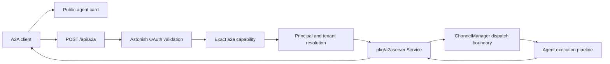

# A2A Protocol — Astonish as Server

## Overview

Astonish exposes an inbound Agent-to-Agent (A2A) JSON-RPC service at `/api/a2a`. Inbound A2A is a dedicated HTTP execution surface, not a messaging channel. It owns A2A task correlation, lifecycle, streaming, cancellation, ownership, and push delivery while reusing the existing agent execution pipeline through an explicit dispatcher boundary.

Outbound A2A is separate: Astonish can also connect to remote agents through `pkg/a2aclient` and A2A-agent configuration. This document covers only the inbound server.

## Architecture

| Concern | Owner |
|---|---|
| Protocol types, task store, Agent Card, push delivery | `pkg/a2a` |
| Task orchestration and explicit reply correlation | `pkg/a2aserver` |
| HTTP JSON-RPC and SSE framing | `pkg/api/a2a_routes.go` |
| OAuth bearer and tenant boundary | `pkg/api/a2a_auth.go`, `pkg/oauthserver`, `pkg/execution` |
| Reused inbound agent execution | `pkg/channels.ChannelManager.Dispatch` |

A2A does not implement `channels.Channel` and is not registered as a channel. The dispatcher reuses the channel execution machinery without giving A2A channel lifecycle or reply-routing ownership. The A2A task ID remains explicit, while `contextId` provides the conversation thread/session identity.

## Protocol surface

| Endpoint | Authentication | Purpose |
|---|---|---|
| `GET /.well-known/agent-card.json` | Public | A2A discovery |
| `POST /api/a2a` | Astonish OAuth bearer with `a2a` | JSON-RPC operations, including streaming responses |

The service retains the supported A2A operations for synchronous and return-immediately message handling, task retrieval, cancellation, push-notification configuration, and streaming. Requests retain the 1 MiB body limit. SSE events are flushed as complete protocol events.

## Authentication and authorization

A2A accepts only access tokens issued by the installation's built-in Astonish OAuth server. The token must:

- pass strict signature, issuer, lifetime, and configured protected-resource audience validation;
- contain the exact `a2a` scope;
- resolve to a valid canonical `execution.Principal`;
- contain resolvable organization and team identity for tenant-scoped execution.

The adapter sets `execution.SurfaceA2A` and authorizes `execution.CapabilityA2A`. The `chat` and `tool:execute` scopes do not imply A2A access, and `a2a` does not imply either of those scopes. Raw tokens from upstream IdPs or separately configured trusted JWKS issuers are not accepted directly.

Administrators grant access in Studio's OAuth settings by creating or editing a client and selecting **A2A access**. The OAuth view displays the canonical endpoint. Because scope grants are fixed at issuance, an existing client/token must be reauthorized or issued again after the `a2a` grant is added.

## Principal and tenant mapping

OAuth validation produces the same canonical principal contract as other protected execution surfaces:

- user grants retain the effective subject and optional delegated actor;
- client-credentials grants produce a service principal identified by client ID;
- organization and team come from validated grant state and cannot be overridden by JSON-RPC parameters;
- task ownership is bound to the authenticated principal **and resolved organization/team**, preventing retrieval, cancellation, or push configuration across principals or tenants.

Task sessions remain isolated from messaging-channel sessions. Service principals cannot gain personal-memory access through the A2A scope.

## Task and response ownership

`pkg/a2aserver.Service` owns task creation, state transitions, part normalization, synchronous reply collection, asynchronous completion, cancellation, push configuration, and streaming events. It supplies a typed reply sink to the dispatcher, preserving task correlation even when multiple requests share a conversation context.

The service supports:

- blocking `message/send` with a correlated completed result;
- return-immediately processing followed by `tasks/get`;
- ordered streaming updates;
- cancellation;
- principal-scoped task access;
- push delivery for configured tasks.

Push targets must use HTTPS and resolve only to public addresses. The service validates a target when it is configured and immediately before delivery, rejects redirects, and rechecks the target at dial time to prevent DNS rebinding. A bounded per-principal active-task limit applies to synchronous and return-immediately work so A2A cannot exhaust daemon resources.

## Configuration and administration

Inbound A2A has no `channels.a2a` configuration. It is available with the OAuth-enabled API surface and uses the OAuth installation issuer/base URL to derive `/api/a2a`. Platform Channels lists only Telegram, Email, and Slack. Persisted legacy `channels.a2a` JSON is ignored, has no runtime effect, and is removed when channel settings are next saved; no database migration is required because the setting is generic JSON.

The public Agent Card advertises the server endpoint and bearer security. Client registration, allowed scopes, token issuance, key lifecycle, and tenant grants are administered through OAuth.

## Security invariants

1. The public Agent Card never grants execution access.
2. Every protocol call requires an Astonish-issued bearer token with exact `a2a` scope.
3. External IdP/JWKS tokens are not direct A2A credentials.
4. Tenant identity comes from validated OAuth grant state, never request data.
5. Task read, cancel, stream, and push operations enforce principal-and-tenant ownership.
6. A2A scope is independent from `chat` and `tool:execute`.
7. Request-size limits and SSE flushing behavior remain enforced.
8. Outbound A2A-agent configuration is independent and unchanged.

## Verification contract

Changes to inbound A2A must prove:

- public Agent Card discovery;
- missing, invalid, expired, wrong-audience, unresolved-tenant, and missing-scope denial before dispatch;
- success with a newly issued exact `a2a` grant;
- synchronous correlation, async retrieval, streaming order, cancellation, push delivery, and cross-principal ownership denial;
- Channels API omission/rejection of A2A and inert legacy JSON;
- no regression to Telegram, Email, Slack, outbound A2A clients, MCP, or Studio chat.
