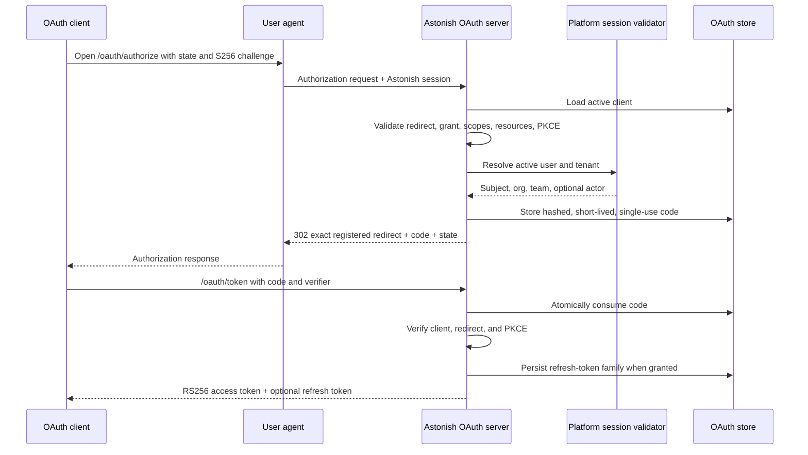

# OAuth Authorization Architecture

## Purpose

Astonish needs a standards-based authorization boundary for machine clients, MCP hosts, delegated agents, and other relying parties without coupling execution security to any one human-login provider. The built-in OAuth authorization server issues Astonish credentials whose tenant, client, user, delegation, resource, and scope semantics Astonish controls. Those credentials are translated into the same canonical `execution.Principal` used by Studio, linked channels, A2A, code mode, and future transports.

This architecture deliberately separates two concerns:

1. **Upstream authentication** proves who a human is. Built-in email/password, SAP Cloud Identity Services (IAS), Keycloak, OIDC, and future SAML adapters belong here.
2. **Downstream authorization** grants an application or workload constrained access to Astonish. The built-in OAuth server belongs here and always issues Astonish-signed access tokens.

An external identity provider does not become an implicit Astonish token issuer. Astonish first validates the upstream login, resolves the user and tenant memberships, and then issues its own narrowly scoped credential. This prevents external claim vocabulary, key rotation, token lifetimes, and provider-specific policy from leaking into every execution surface.

## System boundary

```mermaid
flowchart LR
    Human[Human user] --> Login[Platform login/session]
    IdP[Built-in auth / IAS / Keycloak / future SAML] --> Login
    Login --> SessionValidator[OAuth session validator]

    Admin[Superadmin] --> AdminAPI[OAuth administration API]
    AdminAPI --> OAuthStore[(Platform OAuth store)]

    Client[OAuth client / MCP host / agent] --> Protocol[OAuth protocol endpoints]
    SessionValidator --> Protocol
    Protocol --> OAuthStore
    Protocol --> Signer[Astonish signing key]
    Signer --> AccessToken[Astonish access token]

    AccessToken --> Validator[Strict bearer validator]
    Validator --> Principal[execution.Principal]
    Principal --> Authorizer[Capability authorizer]
    Authorizer --> Tenant[Scoped tenant services]
    Tenant --> MCP[/api/mcp]
```

### Owned components

| Concern | Implementation boundary |
|---|---|
| Protocol semantics and token issuance | `pkg/oauthserver` |
| OAuth persistence contract | `pkg/store/oauth_server.go` |
| Ent-backed platform persistence | `pkg/store/entstore/oauth_server.go`, `ent/platform/schema/oauth_*.go` |
| Public protocol route registration | `pkg/api/oauth_server_routes.go` |
| Superadmin administration routes | `pkg/api/oauth_admin_handlers.go` |
| Existing-session validation | `pkg/api/oauth_session.go` |
| Canonical identity and capability checks | `pkg/execution` |
| Protected MCP transport | `pkg/api/mcp_routes.go` |
| Daemon composition and configuration | `pkg/daemon/run.go`, `pkg/config/app_config.go` |
| Studio administration UI | `web/src/components/platformAdmin/OAuthTab.tsx` |

`pkg/oauthserver` must not import provider-specific authentication logic. It receives a `SessionValidator` and an `OAuthServerStore`, keeping upstream identity and persistence replaceable at the composition root.

## Trust model

### Trusted issuers

The built-in bearer validator trusts only the configured Astonish issuer and only keys owned by that Astonish installation. A token is accepted only when all of the following hold:

- The HTTP credential uses Bearer syntax.
- The JWT algorithm is exactly RS256.
- The JWT has a non-empty `kid`.
- `kid` selects the current in-memory signing key or an active, non-expired persisted Astonish signing key.
- The signature verifies with that key.
- `iss` exactly matches the configured Astonish issuer.
- `aud` contains the intended resource.
- `exp` exists and is valid.
- `nbf`, when present, is not in the future.
- `iat` exists and is not in the future.
- Required scopes are present.
- User or service identity claims form a valid tenant principal.

Unknown algorithms, missing or unknown key IDs, external issuers, malformed JWKs, invalid signatures, missing expiration, invalid time windows, resource mismatch, and incomplete tenant claims fail closed.

External IdP tokens are not accepted by this validator. A separate protocol adapter may validate an external token for an upstream login or a specifically configured inbound integration, but it must resolve that identity into Astonish policy before execution. It must not silently add external keys to the built-in OAuth trust set.

### Canonical principals

Successful validation produces `execution.Principal`, never an unstructured claims map. The principal records:

- `Kind`: user or service.
- `Authentication`: OAuth.
- `Surface`: MCP, A2A, code, Studio, or another explicit transport.
- `Subject`: effective user for user grants.
- `Actor`: delegated workload from `act.sub`, when present.
- `ClientID`: OAuth client identity.
- `Issuer`: Astonish issuer.
- `OrgSlug` and `TeamSlug`: tenant selection.
- `Scopes`: granted capabilities.
- `Authenticated`: explicit trust marker.

A user principal requires a subject. A service principal requires a client ID and has no user subject. Every non-local principal requires complete organization and team identity. The actor never replaces the subject: delegation means “actor acting for subject,” not a second way to bypass user policy.

### Capabilities

Protocol scopes are mapped to typed `execution.Capability` values at the adapter boundary. Tools and agents consume authorization decisions, not raw OAuth strings. `execution.CapabilityAuthorizer` validates the principal and requires an exact scope for OAuth-authenticated requests. Service principals cannot access personal memory even if a future client configuration mistakenly grants a memory scope.

Tenant routing occurs only after validation and authorization. The principal’s organization, team, and user identity select scoped stores; request parameters cannot override the authenticated tenant.

## Protocol surface

The server publishes OAuth authorization-server metadata and protected-resource metadata, plus the following endpoints:

| Endpoint | Role | Authentication |
|---|---|---|
| `/.well-known/oauth-authorization-server` | Authorization-server discovery | Public |
| `/.well-known/oauth-protected-resource` | Protected-resource metadata | Public |
| `/oauth/authorize` | Authorization Code request | Active Astonish platform session |
| `/oauth/token` | Code, refresh, or client-credentials exchange | Client rules depend on grant and client type |
| `/oauth/jwks` | Current public signing key set | Public |
| `/oauth/revoke` | Refresh-token-family revocation | Authenticated client |
| `/oauth/introspect` | Token state inspection | Authenticated client |
| `/api/oauth/*` | Personal client management and discovery view | Authenticated owner; server enforces owner and tenant membership |
| `/api/mcp` | Protected Streamable HTTP MCP server | Valid Astonish bearer token with `tool:execute` |
| `/api/a2a` | Protected inbound A2A JSON-RPC server | Valid Astonish bearer token with exact `a2a` |
| `/.well-known/agent-card.json` | Inbound A2A Agent Card discovery | Public |

Protocol routes are mounted outside the SPA fallback and remain subject to global HTTP security and rate-limiting middleware. The authorization endpoint independently validates the existing platform session; public route registration does not make authorization anonymous.

## Client model

OAuth clients are user-owned platform records bound to an organization and optionally a team. Each client defines:

- Stable `client_id` and display name.
- Public or confidential client type.
- Secret hash for confidential clients; plaintext secrets are never persisted.
- Exact redirect URI allowlist.
- Allowed grant types.
- Allowed protected resources.
- Allowed scopes.
- Active state.

Redirect URIs use exact matching. Authorization requests cannot introduce a redirect, resource, scope, or grant absent from client registration. Deactivating a client prevents new grants. Secret creation and rotation responses may expose a new plaintext secret once; list and normal update responses must never return it.

Platform administrators manage clients through the OAuth tab in Settings. The UI is an administration client of the protected API, not a separate source of truth. All authorization rules remain server-side.

## Grant flows

### Authorization Code with PKCE

Authorization Code is the human-delegated flow for public or confidential relying parties.



S256 PKCE is mandatory. Authorization codes are random, stored only as hashes, short-lived, bound to client and redirect URI, and consumed atomically. Reuse fails. Requested scopes and resources are intersected with the client allowlists. The resulting token carries resolved Astonish tenant identity, not arbitrary tenant values supplied by the client.

### Refresh Token

Refresh tokens are opaque random handles stored as hashes. Every successful refresh consumes the old handle and rotates to a new handle in the same family. The family carries client, subject/service identity, actor, tenant, scopes, and resources.

Replay of a consumed refresh token is a credential-compromise signal. The family is revoked so a stolen predecessor cannot race indefinitely with the legitimate client. Expired, revoked, foreign-client, malformed, or replayed handles do not produce access tokens.

### Client Credentials

Client Credentials represents a workload, not a human. It is available only to an active confidential client registered for that grant and authenticated with its secret. The resulting `execution.Principal` is a service principal:

- `Subject` is empty.
- `ClientID` identifies the workload.
- Organization and team remain mandatory for tenant-scoped execution.
- Granted scopes and resources remain bounded by registration.
- Personal-memory capabilities remain prohibited.

A service token must never be upgraded into a user token merely because a request supplies a user identifier.

## Token format and key lifecycle

Access tokens are short-lived RS256 JWTs. Registered claims include issuer, audience/resource, expiration, issued-at, and optional not-before. Astonish claims carry client, tenant, scopes, effective subject, and delegated actor as applicable.

Signing keys are platform-scoped records containing:

- Unique key ID.
- Algorithm.
- Public JWK.
- Encrypted private key material.
- Lifecycle status.
- Creation and optional retirement time.

At startup, the server loads or creates the active signing key. JWKS publishes public material only. Validators may accept a persisted predecessor while it is active and not expired, allowing access tokens issued before rotation to finish their bounded lifetime. Revoked, expired, malformed, non-RSA, or non-RS256 key records are not trusted.

Private signing material must be encrypted with deployment-stable secret material. Backups must redact or correctly protect credentials according to the platform backup contract. Key rotation must preserve old public keys only for the minimum validation window required by outstanding access tokens.

## Persistence and atomicity

OAuth state is platform-scoped because issuer keys and client identifiers belong to one Astonish installation. Organization binding narrows a client; it does not move the record into an organization database.

The persistence boundary explicitly models:

- OAuth clients.
- Authorization codes.
- Refresh/access token metadata and token families.
- User consent grants.
- Signing keys.

Authorization-code consumption and refresh-token consumption must be atomic compare-and-set operations. Concurrent requests may produce at most one successful consumer. Token handles and authorization codes are stored as one-way hashes. Confidential client secrets are stored as password hashes. Access-token JWTs are not persisted as bearer strings.

Tenant isolation remains the platform invariant: OAuth persistence proves grant state, while request execution still routes through organization/team/personal scoped stores selected from the validated principal.

## Revocation and introspection

Revocation follows the non-disclosure behavior of RFC 7009: an unknown token returns success rather than revealing whether a handle exists. A client may revoke only a token family it owns.

Introspection reports inactive for unknown, expired, consumed, revoked, replay-detected, or foreign-client credentials. It must not turn JWT parsing without signature and claim validation into an authorization decision. Execution surfaces validate access tokens directly through the strict bearer validator and apply live capability/tenant policy afterward.

Client deactivation blocks new issuance. Whether already issued short-lived access tokens remain valid until expiry is governed by validator and operational policy; emergency invalidation requiring immediate effect must use key/client/token-family controls rather than relying on UI state alone.

## Configuration and startup

`storage.auth.oauth_server` configures the built-in server:

```yaml
storage:
  auth:
    oauth_server:
      enabled: true
      issuer: https://astonish.example.com
      resource: https://astonish.example.com/api/mcp
      access_token_ttl_minutes: 15
      refresh_token_ttl_days: 30
```

The server is enabled when `enabled` is omitted. `enabled: false` is an explicit opt-out and removes protocol and administration route registration. Local Studio may derive loopback defaults from the daemon port:

- Issuer: `http://127.0.0.1:<port>`
- Resource: `<issuer>/api/mcp`

Loopback HTTP is a development convenience only. Production deployments require a stable public HTTPS issuer. Issuer identity must not change across routine restarts or replicas. Reverse proxies must preserve the externally registered scheme and host semantics.

The daemon creates the OAuth server only after platform storage and authentication are available. It passes the server into `launcher.NewStudioServer`, which registers discovery, protocol, administration, and MCP routes together. HTTP serving begins before optional chat/model pre-warming so control-plane and authorization endpoints are not blocked by embedding or LLM initialization.

## External identity providers

### Required composition

External IdPs are upstream authenticators. A successful external login must:

1. Validate the provider response using the provider-specific protocol.
2. Resolve or provision an Astonish platform user according to explicit linking policy.
3. Resolve active organization and team membership in Astonish storage.
4. Create or resume an Astonish platform session.
5. Let the built-in authorization endpoint issue an Astonish code/token under normal client, scope, resource, and tenant policy.

Provider claims such as IAS `xs.groups`, Keycloak roles/groups, or SAML attributes may inform provisioning and team mapping, but the resulting Astonish membership is authoritative for execution. Mapping rules must be explicit, tenant-scoped, and auditable.

### Prohibited coupling

- Do not forward an upstream IdP access token to Astonish tools as an Astonish credential.
- Do not trust arbitrary external JWKS in `pkg/oauthserver.ValidateBearer`.
- Do not infer organization/team access solely from an unpersisted external group claim at execution time.
- Do not encode provider-specific claims into the canonical principal contract.
- Do not make OAuth client administration depend on which upstream login provider is active.
- Do not conflate OAuth client secrets with OIDC/SAML application credentials used to connect Astonish to an IdP.

No protected execution transport accepts an external bearer token directly. Inbound A2A is protected by an Astonish-issued OAuth token carrying exact `a2a`; it does not use a trusted-issuer registry, external JWKS configuration, or `UserChannel(a2a, ...)` identity links.

## Security invariants

1. **Fail closed:** parsing is never validation; unknown issuer, key, algorithm, tenant, scope, resource, client, or grant fails.
2. **Astonish-issued downstream tokens:** upstream IdPs authenticate users but do not implicitly authorize Astonish execution.
3. **Exact redirect matching:** no prefix, wildcard, or client-supplied redirect expansion.
4. **PKCE required:** Authorization Code requires S256.
5. **Single-use credentials:** authorization codes and rotated refresh handles are atomically consumed.
6. **No plaintext persistence:** client secrets, authorization codes, refresh handles, and private signing material are hashed or encrypted as appropriate.
7. **Tenant from trusted identity:** org/team context comes from validated grant state and Astonish membership, never request overrides.
8. **Scopes at execution boundary:** OAuth-authenticated execution requires the exact typed capability.
9. **Service/user separation:** service grants cannot impersonate users or access personal memory.
10. **Delegation is explicit:** `act.sub` identifies an actor acting for a subject and does not erase either identity.
11. **Secrets are one-time responses:** administration list/read endpoints never disclose client secrets.
12. **Public metadata contains no secrets:** discovery and JWKS expose only protocol metadata and public keys.
13. **Stable issuer:** production issuer and key protection survive restarts and replica changes.
14. **Route parity:** if the superadmin OAuth destination is available, its administration backend must be registered; explicit disablement must be represented consistently by product behavior.
15. **Startup independence:** OAuth/control-plane availability must not wait on LLM, embedding, MCP discovery, or channel bootstrap.

## Verification contract

Changes to this architecture require tests at the narrowest owning boundary and an end-to-end protocol scenario.

### Library and storage tests

- Client validation and secret hashing.
- Authorization Code + S256 PKCE success and rejection cases.
- Atomic code consumption and replay rejection.
- Refresh rotation, family revocation, expiry, and replay behavior.
- Client Credentials user/service separation.
- Revocation non-disclosure and client ownership.
- Signing-key creation, persistence, rotation window, and malformed-key rejection.
- Strict bearer validation and principal mapping.
- SQLite and PostgreSQL persistence parity where integration infrastructure is available.

### HTTP and execution tests

- Discovery, protected-resource metadata, and JWKS shape.
- Superadmin-only administration routes and one-time secret disclosure.
- Middleware handling for missing, invalid, insufficiently scoped, wrong-resource, expired, and revoked credentials.
- MCP initialization and tool invocation with the authenticated tenant principal.
- Tenant isolation across organizations and teams.
- Daemon readiness while chat pre-warming is still running.

### External IdP acceptance tests

Each future IAS, Keycloak, OIDC, or SAML integration must prove:

- Provider response validation.
- Account-linking and group/team mapping policy.
- Astonish membership resolution.
- Authorization Code issuance through the same built-in OAuth server.
- Astonish-signed downstream access token.
- Rejection of the raw upstream token at the built-in OAuth bearer boundary.

These are architectural acceptance criteria, not a record of project completion. Temporary status, gap, or remaining-work documents must not replace this contract.
t replace this contract.
