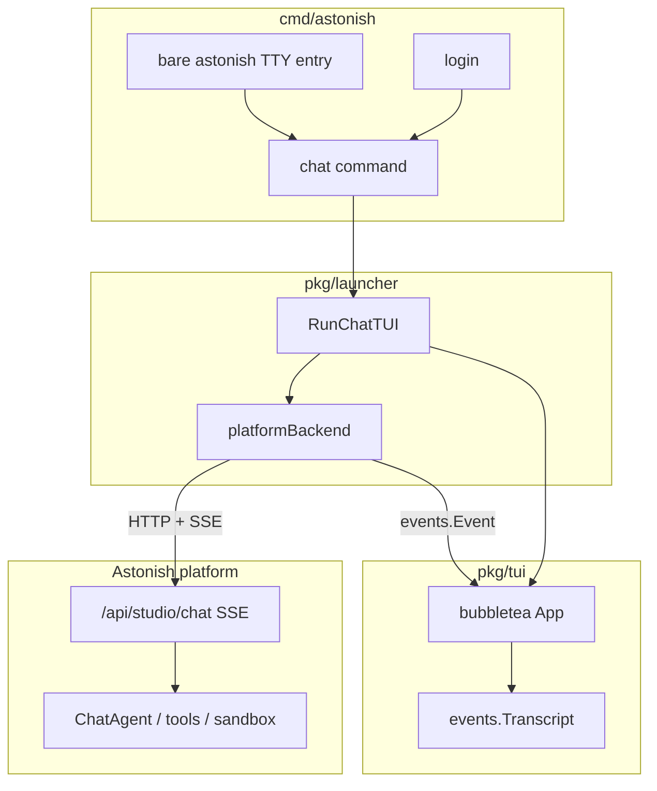

# Terminal App (TUI)

## Overview

Astonish ships a **fullscreen terminal chat app** comparable to Claude Code, OpenCode, and Grok Build CLI.

**Chat is always platform-backed.** Even a local installation requires authentication against the platform (`astonish login <url>`). There is **no** in-process / personal-mode CLI chat path.

**Entry:** `astonish chat` (requires login). On an interactive TTY with an existing login, bare `astonish` opens the same app.

## Architecture



### Packages

| Package | Role |
|---------|------|
| `pkg/tui` | bubbletea UI (header, viewport, input, status, theme) |
| `pkg/tui/events` | `Event` kinds + pure `Transcript` reducer |
| `pkg/tui/backend` | `Backend` interface |
| `pkg/launcher/tui_chat.go` | `RunChatTUI`, `platformBackend` (SSE → events) |
| `pkg/client` | Authenticated HTTP + SSE client |

### Auth requirement

If `client.IsRemoteMode()` is false (no `~/.config/astonish/remote.yaml` / login), `astonish chat` exits with instructions to run `astonish login <url>`. Bare `astonish` only launches the TUI when both stdin/stdout are TTYs and the CLI is already logged in; otherwise it keeps normal help/error behavior for scripts.

### Event model

All UI state is driven by `events.Event`. The platform backend maps Studio SSE types (`text`, `tool_call`, `tool_result`, `approval`, …) into the same kinds. Unknown / Studio-only events soft-degrade to `system` notices.

### Transcript reducer

`Transcript.Apply(Event)`:

- Sticky agent bubble for streaming text
- Tool activity folds for call/result pairs
- Approval sets `Awaiting`; next user message is the approval response

## UI chrome

```
header: Astonish · platform · session          https://…
────────────────────────────────────────────────────────
transcript viewport
────────────────────────────────────────────────────────
[live status / spinner]
╭──────────────────────────────────────────────────────╮
│ ❯  Message Astonish…                                 │  ← bordered composer
╰──────────────────────────────────────────────────────╯
provider / model                         auto-approve|normal
Enter send · ctrl+j newline · /help · ctrl+c quit
```

Composer styles live in `theme.go` (`ApplyTextareaStyles` clears default
AdaptiveColor cursor-line backgrounds that break dark alt-screen UIs).

## Rendering

| Surface | Implementation |
|---------|----------------|
| User messages | Full-width orange outline bubble; long prompts are height-capped and use a bottom-border `double-click to expand/collapse` affordance |
| Agent markdown | `pkg/tui/render.Markdown` — headings, lists, inline code/bold |
| Code fences | `pkg/tui/render.CodeBlock` — chroma highlight + numeric gutter |
| Tool activity | `pkg/tui/render.ActivitySummary` + `StatsFromSteps` (`+N/−M`), with categorized collapsed summaries, always-visible tool previews, and click-to-expand per-tool details |
| File diffs | `pkg/tui/render.FileDiff` / `DiffFromToolArgs` from `edit_file`/`write_file` args |

Streaming: unclosed fences render as incomplete code blocks (header shows `…`).

### Sticky agent (Studio parity)

During a turn with tools, there is **one** agent bubble:

1. Interstitial text between tools **replaces** the previous text (not stacked).
2. While `Provisional`, it renders as **Thinking** (muted), not the final response style.
3. All tools fold into **one** activity block for the turn.
4. Layout order: `user → activity → agent`.
5. On `done`, provisional is cleared and the last text is rendered as the full agent response (markdown/code).

## Rendering roadmap

| Phase | Surface |
|-------|---------|
| Done | Composer, markdown/code/tables, sticky Thinking, activity + diffs |
| Done | Approval overlay (`y`/`n`), sessions picker (`/sessions`, `ctrl+l`), resume history, `/new` |
| Done | Bare `astonish` TTY entry and local `@file` mention completion/context injection |
| Done | Terminal plan mode (`/plan`, `shift+tab`) via per-turn `systemContext` |
| Later | Deeper reconnect polish |

### Approvals

When SSE emits `approval`, the TUI shows a focused card (tool name + args preview).
Keys: `y` / `enter` approve, `n` / `esc` deny, `1`–`9` pick option. Response is sent as a
follow-up `RunTurn` message (same as Studio).

### Sessions

- `ctrl+l` or `/sessions` — list sessions, `enter` resume, `n` new, `esc` close
- `ctrl+n` or `/new` — clear local session id; next message creates a new server session
- Click a tool activity block to expand/collapse detailed execution rows; `ctrl+o` toggles the latest activity
- Drag across transcript text to select it; releasing the mouse automatically copies the selected plain text to the system clipboard
- `astonish chat --resume <id>` — loads history via `GET /api/studio/sessions/{id}` on open

### `@file` mentions

Typing `@` plus part of a local relative path opens a fuzzy file picker above the composer. Selecting a file inserts `@path/to/file`. On submit, the terminal app reads each mentioned file from the current working directory and appends a bounded `<context from @file mentions>` section to the message sent to the platform, while the transcript keeps showing the user's original text. Absolute paths, directory mentions, workspace escapes, and oversized files are rejected before the turn is sent.

### Plan mode

`/plan` or `shift+tab` toggles a terminal-only plan mode, matching the convention used by coding-agent CLIs. While enabled, the footer shows `plan` and each normal user turn carries a hidden per-turn `systemContext` instructing the platform agent to produce a concise plan without executing tools or making changes. Approval responses deliberately do **not** inherit this context because they are part of an already-running approval protocol. Starting or resuming a session clears the toggle so mode does not leak across conversations. The mode label is intentionally minimal for now; future modes can make this more meaningful (for example deep research, report, or build-oriented modes).

### Reconnect behavior

If the Studio SSE connection returns a read error after a session id is known, the platform backend checks `GET /api/studio/sessions/{id}/status`. If the server still has an active runner, the TUI reconnects to `GET /api/studio/sessions/{id}/stream` and continues mapping SSE events into the same transcript. A completed stream (`io.EOF`) remains the normal end-of-turn path.

## CLI behavior

| Invocation | Behavior |
|------------|----------|
| `astonish login <url>` | Authenticate to platform |
| `astonish` | TUI against platform when stdin/stdout are TTYs and login exists |
| `astonish chat` | TUI against platform |
| `astonish chat --resume ID` | Resume session |
| `astonish chat model provider:model` | Pin model via platform API |
| Without login | Error: run `astonish login` for `chat`; bare `astonish` prints normal usage |

## Invariants

1. TUI does not reimplement agent logic — platform runs the agent.
2. No in-process CLI chat backend.
3. Report three-signal gate remains Studio SPA concern.
4. `cmd/astonish` stays thin — no bubbletea models there.
5. Single binary.

## Related docs

- `docs/architecture/remote-cli-client.md` — login, tokens, remote command routing
- `docs/architecture/chat-rendering-pipeline.md` — Studio SPA pipeline (UX reference)
- `pkg/tui/AGENTS.md`
