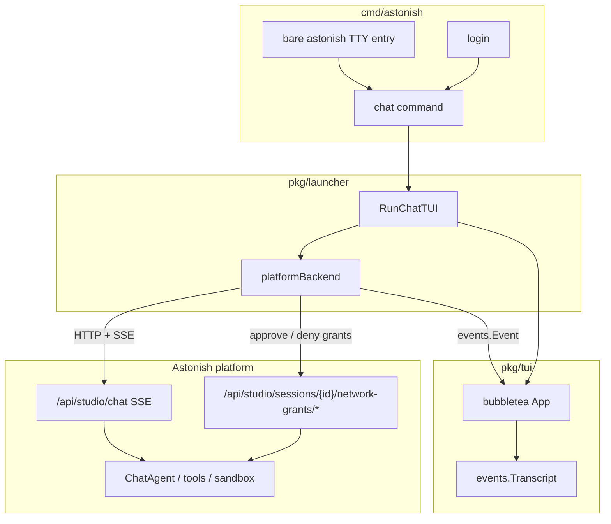

# Terminal App (TUI)

## Overview

Astonish ships a **fullscreen terminal chat app** comparable to Claude Code, OpenCode, and Grok Build CLI.

**Chat is always platform-backed.** Even a local installation requires authentication against the platform (`astonish login <url>`). There is **no** in-process / personal-mode CLI chat path.

**Entry:** `astonish chat` (requires login). On an interactive TTY with an existing login, bare `astonish` opens the same app.

## Architecture



### Packages

| Package | Role |
|---------|------|
| `pkg/tui` | bubbletea UI (header, viewport, input, status, theme) |
| `pkg/tui/events` | `Event` kinds + pure `Transcript` reducer |
| `pkg/tui/backend` | `Backend` interface |
| `pkg/launcher/tui_chat.go` | `RunChatTUI`, `platformBackend` (SSE → events) |
| `pkg/client` | Authenticated HTTP + SSE client |

### Auth requirement

If `client.IsRemoteMode()` is false (no `~/.config/astonish/remote.yaml` / login), `astonish chat` exits with instructions to run `astonish login <url>`. Bare `astonish` only launches the TUI when both stdin/stdout are TTYs and the CLI is already logged in; otherwise it keeps normal help/error behavior for scripts.

### Event model

All UI state is driven by `events.Event`. The platform backend maps Studio SSE types (`text`, `tool_call`, `tool_result`, `approval`, `network_denial_hint`, …) into the same kinds. Unknown / Studio-only events soft-degrade to `system` notices.

### Transcript reducer

`Transcript.Apply(Event)`:

- Sticky agent bubble for streaming text
- Tool activity folds for call/result pairs
- Approval sets `Awaiting`; next user message is the approval response
- Network denial prompts set `Awaiting`; the selected allow/deny key calls the Studio network-grant API directly

## UI chrome

```
Astonish · https://… · user@example.com          Usage 4.6k · in 1.2k · out 3.4k
────────────────────────────────────────────────────────
transcript viewport
────────────────────────────────────────────────────────
[live status / spinner]
╭──────────────────────────────────────────────────────╮
│ ❯  Message Astonish…                                 │  ← bordered composer
╰──────────────────────────────────────────── Normal ──╯
provider / concrete-model                auto-approve
Enter send · ctrl+j newline · /help · ctrl+c quit
```

The header intentionally stays a single row: the left side identifies the connected Astonish platform URL and logged-in user from the remote login config; the right side mirrors Studio Chat's Usage control with cumulative token usage (`total`, `input`, `output`) from live `usage` SSE events and from resumed session `totalUsage` metadata. The layout consumes the full reported terminal height so the footer help line lands on the final row instead of leaving a blank strip below the TUI.

The footer metadata shows the active provider and resolved concrete model when the platform reports them through model-status or `model_changed` events. It deliberately avoids displaying the raw model label `default`, because that is a cascade placeholder rather than useful runtime context; until a concrete model is known, the footer shows the provider with `model resolving…`.

Composer styles live in `theme.go` (`ApplyTextareaStyles` clears default
AdaptiveColor cursor-line backgrounds that break dark alt-screen UIs).

## Rendering

| Surface | Implementation |
|---------|----------------|
| Empty state | Centered welcome card inside the viewport for new/empty chats, with an orange centered title and concise onboarding copy; it is not a transcript item and disappears as soon as the first user message starts the conversation |
| User messages | Full-width warm-accent outline bubble; long prompts are height-capped and use a bottom-border `double-click to expand/collapse` affordance |
| Agent markdown | `pkg/tui/render.Markdown` — headings, lists, inline code/bold |
| Code fences | `pkg/tui/render.CodeBlock` — chroma highlight + numeric gutter |
| Tool activity | `pkg/tui/render.ActivitySummary` + `StatsFromSteps` (`+N/−M`); click-to-expand reveals **raw request args and response JSON** (not file diffs) |
| Network authorization | Inline transcript notice plus a focused approval card for OpenShell proxy denials; `enter`/`y` allows the blocked host, `b` allows the suggested broader pattern, and `n`/`esc` denies |
| File diffs | **Main-thread** `ItemFileDiff` dual-gutter editor view (`old`/`new` line numbers + ± content) on successful `edit_file`/`write_file`. Prefers `verification_context`; falls back to args |

Streaming: unclosed fences render as incomplete code blocks (header shows `…`).

### Sticky agent (Studio parity)

During a turn with tools, there is **one** agent bubble:

1. Interstitial text between tools **replaces** the previous text (not stacked).
2. While `Provisional`, it renders as **Thinking** (muted), not the final response style.
3. All tools fold into **one** activity block for the turn.
4. Layout order: `user → activity → file_diff(s) → agent`.
5. On `done`, provisional is cleared and the last text is rendered as the full agent response (markdown/code).

## Rendering roadmap

| Phase | Surface |
|-------|---------|
| Done | Composer, markdown/code/tables, sticky Thinking, activity + diffs |
| Done | Approval overlay (`y`/`n`), sessions picker (`/sessions`, `ctrl+l`), resume history, `/new` |
| Done | Bare `astonish` TTY entry and local `@file` mention completion/context injection |
| Done | Terminal plan mode (`/plan`, `shift+tab`) via per-turn `systemContext` |
| Later | Deeper reconnect polish |

### Approvals

When SSE emits `approval`, the TUI shows a focused card (tool name + args preview).
Keys: `y` / `enter` approve, `n` / `esc` deny, `1`–`9` pick option. Response is sent as a
follow-up `RunTurn` message (same as Studio).

### Network authorization prompts

When OpenShell blocks outbound network access, Studio emits `network_denial_hint`. The terminal backend maps that into `KindNetworkDenial`, preserving the session id, sandbox name, blocked host/port, binary, rationale, security notes, and suggested broader pattern. If the SSE hint carries only a session id, the backend polls `GET /api/studio/sessions/{id}/network-denials` to hydrate pending draft-policy details before rendering the prompt. The event is emitted generically for any blocked `http://` or `https://` endpoint the backend can identify, including shell-command/curl failures where the failed output is generic but the original command contains URLs.

The UI mirrors Studio Chat’s `NetworkDenialPrompt` in terminal form:

- `enter` / `y` approves the specific chunk when a `chunk_id` exists; stdout-derived denials without a chunk use the broader host/port approval endpoint.
- `b` approves `broader_pattern` when the backend suggested one.
- `n` / `esc` denies or acknowledges the pending denial.

Approvals and denials call the network-grant REST endpoints directly instead of sending a normal chat message. The prompt is dismissed immediately when the user presses an allow/deny key; the REST call and optional retry run asynchronously so the UI can repaint with an “Approving network access…” progress state instead of leaving the dialog visible. After a successful approval, the terminal sends the same retry instruction Studio uses: “I just approved network access to <host>. Please retry the previous command that was blocked by the proxy.”

### Sessions

- `ctrl+l` or `/sessions` — list sessions, `enter` resume, `d` delete with confirmation, `n` new, `esc` close
- `ctrl+n` or `/new` — clear local session id; next message creates a new server session
- Click a tool activity block to expand/collapse detailed execution rows; `ctrl+o` toggles the latest activity
- Drag across transcript text to select it; releasing the mouse automatically copies the selected plain text to the system clipboard
- `astonish chat --resume <id>` — loads history via `GET /api/studio/sessions/{id}` on open

### Paste handling

Pastes of up to three lines are inserted into the composer as-is and the composer grows vertically for multi-line typed input (up to four visible rows). Pasting four or more lines replaces the composer value with a compact placeholder such as `[Pasted: 8 lines]`, storing the full content for submit. Explicit paste events (`Ctrl+V`, bracketed paste, clipboard paste bindings) collapse immediately. macOS `Command+V` is usually injected by the terminal as ordinary input rather than a paste event; that path collapses as soon as the composer reaches four lines (without waiting for a later keystroke). Any trailing characters that still arrive in the same short paste stream are merged into the same paste block and the placeholder line count is updated. Explicit multi-line editing with `Shift+Enter` / `Alt+Enter` / `Ctrl+J` is left expanded. Pressing enter expands the placeholder back to the full pasted content for history, transcript, `@file` expansion, and the platform turn. Each `[Pasted: N lines]` token is atomic: left/right (and word-motion) keys jump over the whole token, typing cannot insert inside it, and Backspace / `Ctrl+W` / `Alt+Backspace` / Delete remove the entire token in one step.

### Image paste

Pasting an image from the system clipboard (`Ctrl+V` / Super+V, and empty text pastes that only contain image data) inserts an atomic placeholder such as `[image #1]`. Multiple images increment the index (`#2`, `#3`, …). Image tokens share the same atomic navigation/delete behavior as text-paste placeholders. On submit, remaining image tokens are sent to Studio as multimodal `attachments` (base64 PNG/JPEG/GIF) while the user transcript keeps the `[image #N]` markers.

Clipboard image reads are platform-specific:

- **macOS**: `osascript` pasteboard (`PNGf`, with TIFF→PNG via `sips`)
- **Linux**: Wayland `wl-paste --type image/*` first, then X11 `xclip -t image/*`
- Other platforms: image clipboard read is unavailable (text paste still works)

### `@file` mentions

Typing `@` plus part of a local relative path opens a fuzzy file picker above the composer. Selecting a file inserts `@path/to/file`. On submit, the terminal app reads each mentioned file from the current working directory and appends a bounded `<context from @file mentions>` section to the message sent to the platform, while the transcript keeps showing the user's original text. Absolute paths, directory mentions, workspace escapes, and oversized files are rejected before the turn is sent.

### Model selection

`/model` (alias `/models`) opens a two-step picker overlay:

1. **Provider** — lists configured provider instances from `GET /api/settings/providers/effective`, plus a `(cascade default)` option that clears the session pin.
2. **Model** — lists models for the selected provider via `GET /api/providers/{id}/models`.

↑↓ move, type to filter, Enter selects, Esc goes back/closes. Applying a model calls `PATCH /api/studio/sessions/{id}/model` when a session exists, or stores a pending pin applied on the first chat turn (via `provider`/`model` on the Studio chat request) when the session has not been created yet. The footer updates to the effective provider/model after the pin is applied.

Starting a new chat (`/new`, `ctrl+n`, or deleting the active session) clears any session/pending pin display and reloads cascade defaults into the footer. Resuming a session always reloads that session's model-status so switching between pinned and default sessions keeps the footer accurate.

### Plan mode

`/plan` or `shift+tab` toggles a terminal-only plan mode, matching the convention used by coding-agent CLIs. Mode changes are UI state only: they do not append system messages to the transcript. The current mode is embedded in the composer bottom border (`Normal` on a softened gray border, `Plan` on a warm-accent border). While enabled, each normal user turn carries a hidden per-turn `systemContext` instructing the platform agent to produce a concise plan without executing tools or making changes. Approval responses deliberately do **not** inherit this context because they are part of an already-running approval protocol. Starting or resuming a session clears the toggle so mode does not leak across conversations. Future modes can reuse the same composer-border affordance (for example deep research, report, or build-oriented modes).

### Reconnect behavior

If the Studio SSE connection returns a read error after a session id is known, the platform backend checks `GET /api/studio/sessions/{id}/status`. If the server still has an active runner, the TUI reconnects to `GET /api/studio/sessions/{id}/stream` and continues mapping SSE events into the same transcript. A completed stream (`io.EOF`) remains the normal end-of-turn path.

## CLI behavior

| Invocation | Behavior |
|------------|----------|
| `astonish login <url>` | Authenticate to platform |
| `astonish` | TUI against platform when stdin/stdout are TTYs and login exists |
| `astonish chat` | TUI against platform |
| `astonish chat --resume ID` | Resume session |
| `astonish chat model provider:model` | Pin model via platform API |
| Without login | Error: run `astonish login` for `chat`; bare `astonish` prints normal usage |
| Bare `astonish` with piped stdin or redirected stdout | Prints normal usage plus a hint that interactive chat requires a TTY |

## Invariants

1. TUI does not reimplement agent logic — platform runs the agent.
2. No in-process CLI chat backend.
3. Report three-signal gate remains Studio SPA concern.
4. `cmd/astonish` stays thin — no bubbletea models there.
5. Single binary.

## Related docs

- `docs/architecture/remote-cli-client.md` — login, tokens, remote command routing
- `docs/architecture/chat-rendering-pipeline.md` — Studio SPA pipeline (UX reference)
- `pkg/tui/AGENTS.md`
