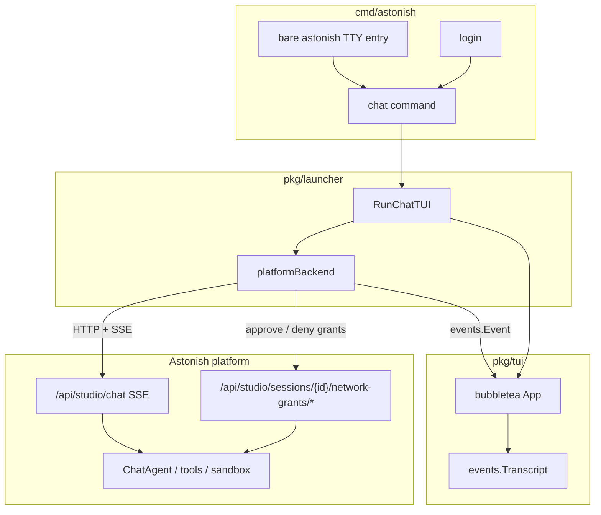

# Terminal App (TUI)

## Overview

Astonish ships a **fullscreen terminal chat app** comparable to Claude Code, Codex, OpenCode, and Grok Build. It has two entry points that share the same `pkg/tui` presentation layer:

- **`astonish chat`** — platform-backed. Even a local installation requires authentication (`astonish login <url>`); the agent runs on the platform and the TUI streams Studio SSE.
- **`astonish code`** — **local code mode**. The single binary runs the agent loop **in-process** and executes its compiled-in tools directly on the host filesystem in the working directory. There is no daemon, no HTTP, and no login. This is the Claude-Code-style local coding path.

**Entry:** `astonish chat` (requires login) or `astonish code` (no login). On an interactive TTY with an existing login, bare `astonish` opens the platform chat app.

## Architecture



### Packages

| Package | Role |
|---------|------|
| `pkg/tui` | bubbletea UI (header, viewport, input, status, theme) |
| `pkg/tui/events` | `Event` kinds + pure `Transcript` reducer |
| `pkg/tui/backend` | `Backend` interface |
| `pkg/launcher/tui_chat.go` | `RunChatTUI`, `platformBackend` (SSE → events) |
| `pkg/launcher/tui_code.go` | `RunCodeTUI`, `localAgentBackend` (in-process ADK runner → events) |
| `pkg/client` | Authenticated HTTP + SSE client |

### Auth requirement

If `client.IsRemoteMode()` is false (no `~/.config/astonish/remote.yaml` / login), `astonish chat` exits with instructions to run `astonish login <url>`. Bare `astonish` only launches the TUI when both stdin/stdout are TTYs and the CLI is already logged in; otherwise it keeps normal help/error behavior for scripts. **`astonish code` has no auth requirement** — it never contacts a platform.

## Code mode (local, in-process)

`astonish code` runs the entire agent locally in the same process, like Claude Code / Codex / OpenCode / Grok Build. It reuses the same `pkg/tui` presentation and event model as platform chat; only the backend differs.

**Flow:** `cmd/astonish/code.go:handleCodeCommand` → `launcher.RunCodeTUI` →

1. `config.LoadAppConfig()`.
2. `forceHostExecution(appConfig)` — sets `Sandbox.Enabled = false`. This is the defining line of code mode: with the sandbox off, every filesystem/shell tool resolves against the process working directory instead of a sandbox backend.
3. Resolve the working directory (`--dir`/`-C`, else `os.Getwd()`) and `os.Chdir` into it, so tools that default to the CWD (grep, find, shell) operate there.
4. Resolve the model: explicit `-m` flag wins, else the configured cascade default (`general.default_provider` / `default_model`).
5. Build a per-directory persistent session store: `session.FileStore` under `<sessionsDir>/code/` (`codeSessionsDir`), passed to the factory via `ChatFactoryConfig.SessionService`.
6. `NewWiredChatAgent(ctx, …, PlatformMode: false, AllowMissingProvider: true, SessionService: fileStore)` — the same wiring choke point Studio uses, minus sandbox wrapping.
7. Build `localAgentBackend` (with the store and a directory-scoped `userID`) and hand it to `tui.Run`.

### Starting without a model

Code mode opens even when no provider/model is configured. When provider resolution yields nothing, `NewWiredChatAgent` (with `AllowMissingProvider: true`) installs a **placeholder LLM** (`provider.NewPlaceholderLLM`) so the full agent — tools, MCP, session, sandbox-off wiring — is still built, and reports `ProviderConfigured: false`.

While unconfigured:

- `Info().Notices` includes a hint to run `/model`.
- `RunTurn` short-circuits with a system message ("Type /model …") instead of attempting generation.

The user picks a provider/model through the existing `/model` picker (`pkg/tui/model_picker.go`). Applying a selection calls `localAgentBackend.SetModelPin`, which:

1. Builds the real LLM via `provider.GetProvider` and hot-swaps it into the `SwappableLLM` (tools/MCP/session survive).
2. Marks the backend configured and updates the footer.
3. **Persists** the choice to `~/.config/astonish/config.yaml` (`general.default_provider` / `default_model`) via `config.SaveAppConfig`, so the next `astonish code` starts with that model. A save failure is non-fatal — the in-memory swap already took effect.

The `/model` picker lists provider *instances* from `AppConfig.Providers`. When none exist yet, the user adds one with `/provider` (below) without leaving the app.

### Managing providers with `/provider`

Code mode is **file-only**: it reads and writes provider configuration in `~/.config/astonish/config.yaml` and never connects to a platform database. To let users configure providers without dropping to `astonish setup`, code mode adds a `/provider` overlay (`pkg/tui/provider_picker.go`) that lists, adds, and removes provider instances.

This capability is exposed through an **optional** backend interface, `backend.ProviderAdminBackend` (`ListProviderInstances` / `ProviderTypes` / `AddProvider` / `RemoveProvider`), implemented only by `localAgentBackend`. The platform backend does **not** implement it — platform provider management stays in the database via Studio settings. The TUI type-asserts for the capability: `/provider` (command, help entry, and slash-completion) is only offered when the active backend implements it, so platform chat is unaffected.

**Code mode never surfaces platform providers.** `ListProviderInstances` returns **only** the local config.yaml providers. Platform providers are intentionally *not* fetched or displayed in code mode: their credentials live on the platform and must never transit to a local surface, and a read-only "phantom" entry the user cannot use would add no value. The direction that *does* merge is the opposite one — the **platform** merges config.yaml providers into its own runtime and effective view (see below and `multi-tenant-platform.md` / `api-studio.md`): the daemon captures `AppConfig.Providers` at bootstrap, `cascadePlatformProviders` merges them with the DB cascade (config.yaml is the base layer, DB wins on a name collision) so both are runnable, and it also publishes them via `api.SetLocalProviders` so `GET /api/settings/providers/effective` returns them under `provider_sources[name].source == "local"` with `read_only: true`, deduped to one entry per instance name regardless of pod count. **Secrets are always masked in that HTTP view** (`maskValue` over `providerSecretKeysForType`); the real keys stay in the trusted daemon process and never cross the API boundary.

The catalog of provider types offered by the overlay is `codeProviderTypes()` in `pkg/launcher/tui_code.go`. It mirrors the full set of providers Astonish supports (`provider.ProviderDisplayNames`) so anything configurable from a plaintext config file can be added through `/provider`: **OpenAI, Anthropic, Google GenAI (Gemini), Groq, xAI, OpenRouter, Poe, SAP AI Core, LiteLLM, OpenAI Compatible, Ollama, and LM Studio.** Each entry declares the input fields it needs via `backend.ProviderField` (label, `Secret`, `Default`, `Optional`), and the overlay form renders those fields generically — most providers need only an `api_key`, while SAP AI Core collects OAuth credentials (`client_id`, `client_secret`, `auth_url`, `base_url`, `resource_group`) and LiteLLM/OpenAI-Compatible add a `base_url`. A drift-guard test (`TestCodeProviderTypes_CoversAllSupportedProviders`) fails if a newly-supported provider is not added to this catalog.

`AddProvider` writes the instance (`type` + fields such as `base_url`) into `AppConfig.Providers`, stores the API key directly in `config.yaml` under `providers.<name>.api_key`, and calls `config.SaveAppConfig`. Because `GetProvider` reads `api_key` straight from the instance map, the new provider is usable immediately — the user can then pick it in `/model`. `RemoveProvider` deletes the instance and clears `general.default_*` if it pointed at the removed provider.

> **Config vs. database boundary.** Local `code` mode loads and persists only from the config file — it needs no database connection. Platform mode continues to use its database (and can also read config). Do not couple the code-mode provider path to `entstore` or any platform store.

**Per-turn driving.** `localAgentBackend.RunTurn` builds an ADK agent + `runner.Runner` around the wired `ChatAgent` and iterates `runner.Run(...)`. It is a slim version of Studio's `ChatRunner.Run`: it handles text (with partial-streaming dedup), tool calls/results (redacted, `announce_plan` skipped), usage, and approvals via the same state-delta + turn-suspension protocol. Studio-only surfaces (network-denial prompts, tutorial blueprints, app previews) are intentionally omitted because there is no sandbox and no platform.

**Event bridge (Option B).** Rather than duplicate SSE→event mapping, `RunTurn` emits the exact `(type, data)` payloads `ChatRunner.emitEvent` produces, marshals each into a `client.SSEEvent`, and feeds it through the shared `mapSSEToEvents` translator in `tui_chat.go`. There is exactly one translator; new event kinds are added there, never in a code-mode-only path.

**Sessions.** Code-mode sessions are **persisted to disk** via a `session.FileStore` (wrapped by `common.NewAutoInitService`) rooted at `<sessionsDir>/code/`, under the app name `astonish_code`. They survive restarts and are isolated from Studio/chat sessions two ways: the distinct app name, and the dedicated `code/` subdirectory. Sessions are **scoped per working directory**: `RunCodeTUI` derives the session `userID` from a stable hash of the absolute working directory (`codeUserIDForDir`), and `FileStore.List` filters by `(appName, userID)`, so sessions from one project never appear in another. **Startup is always a fresh session** — code mode does not auto-resume the last conversation. `ListSessions` enumerates persisted sessions for the current directory (via `FileStore.ListSessionMetas`, newest-first, with titles and message counts) and `ResumeSession` loads a chosen transcript, powering the `/sessions` picker. A new session's title is derived from its first user message (`deriveSessionTitle` → `FileStore.SetSessionTitle`). All session-service calls route through `effectiveUserID()` (falling back to the base `local_user` when unscoped, e.g. in tests). Because the store is a `FileStore`, code-mode transcripts also get on-disk credential redaction wired by the factory.

**Safety model.** Tools run unsandboxed with the user's own permissions. Safety comes from two code-mode authorization gates (see [Tool & folder authorization](#tool--folder-authorization-code-mode)): non-read-only tools require per-tool authorization, and paths outside the project working directory require folder-access authorization. `--auto-approve` / `--yolo` bypasses both gates (matching Claude Code).

**Project guidance (AGENTS.md).** Code mode follows the [agents.md](https://agents.md) convention used by Claude Code, opencode, and Codex: at startup it loads project instructions into the system prompt. `RunCodeTUI` builds the agent with `LoadProjectContext: true`, and the factory calls `agent.LoadProjectContext(workspaceDir)`, which:

- walks **upward** from the working directory to the project root (the first ancestor containing `.git`), reading the nearest `AGENTS.md` at each level (falling back to `CLAUDE.md` when a directory has no `AGENTS.md`);
- prepends the global `~/.config/astonish/AGENTS.md` (honoring `XDG_CONFIG_HOME`) at lowest precedence;
- concatenates them **root-first so the nearest file appears last** (highest precedence), skips empty files, tags each block with a provenance comment, and caps the total at ~32 KiB.

The merged Markdown is injected as a `## Project Guidance` section in `SystemPromptBuilder` (near the top, after INSTRUCTIONS.md), so conventions, build/test commands, and gotchas are always in view. Platform chat does **not** load these files — it uses per-team instructions from the database — so the behavior is gated behind `ChatFactoryConfig.LoadProjectContext`.

**MCP tools are first-class in code mode.** Unlike Studio/platform — where MCP tools stay behind `search_tools` to keep prompts small when an org exposes thousands of tools — code mode injects every configured MCP server's toolset directly onto the main thread. `tui_code.go` sets `ChatFactoryConfig.CodeMode: true`, which makes `NewWiredChatAgent` pass the sanitized MCP toolsets to `NewChatAgent` (as llmagent `Toolsets`) and set `SystemPromptBuilder.MCPFirstClass`. The agent can then call any MCP tool by its bare name without a discovery step, and the prompt lists them under an `## MCP Tools (available directly)` section. This matches the personal, few-servers reality of a coding session. See [mcp.md](mcp.md#tool-surfacing-first-class-in-code-discoverable-in-platform).

**Log isolation.** Because code mode runs the agent in-process while the bubbletea alt-screen owns the terminal, `RunCodeTUI` redirects the standard `log` writer and slog's default handler away from the terminal for the TUI's lifetime (`redirectLogsForTUI`). This prevents background log lines — notably ADK's `runner` `log.Printf("Event from an unknown agent: …")`, emitted for every event whose author (`chat`/`system`/`knowledge`) differs from the runner's root agent name — from corrupting the display. Studio chat never hit this because its logs go to the daemon log file. In `--debug`, the logs are written to `<configDir>/code-debug.log` instead of being discarded, and the previous logging config is restored on exit.

**Native prerequisites are self-provisioning.** Code mode runs on the user's own machine, not in a sandbox container, so the two native prerequisites are handled automatically rather than assumed pre-installed. The tree-sitter shared library (`libastonish-treesitter.{so,dylib}`) is **compiled from embedded C sources and cached on first use** when it is not already present — see [code-intelligence.md](code-intelligence.md#library-resolution-and-local-auto-build). This needs a C compiler (Xcode Command Line Tools on macOS); without one, the structural tools return an actionable error and the agent falls back to `grep_search`/`find_files`. **ripgrep is provisioned too:** `pkg/tools/ripgrep.ResolvePath` prefers an `rg` on `PATH` and otherwise downloads the pinned, SHA256-verified official release into `<config-dir>/astonish/bin/` (kicked off in the background at startup). `grep_search` is **ripgrep-only** — the naive pure-Go grep was removed, so if `rg` cannot be resolved the tool errors rather than silently returning worse results. So `astonish code` works out of the box on a stock machine, with tree-sitter navigation and full ripgrep search lighting up after the one-time setup.


**Context usage in the header (estimated fallback).** The header shows `Context <used>/<window> (<pct>)` from `usage` events. Some providers — notably local OpenAI-compatible proxies — return no token usage metadata, which would leave the figure at `Context 0`. In that case `driveTurn` calls `emitEstimatedContext`, which estimates the current context fill from the session's accumulated contents (via `session.EstimateTokens`, the same ~3 chars/token heuristic the compactor uses) and emits a `usage` event flagged `estimated`. Estimated readings update the context-occupancy figure (`Transcript.ContextTokens`, tracked as a max) but are **not** accumulated into cumulative session usage, since each estimate represents the whole current context rather than a per-call delta.

**Context on resume.** Both the estimate above and real provider usage only arrive *during a turn*, so a freshly resumed session would otherwise show `Context 0` until the next message. To avoid that, `ResumeSession` estimates the loaded session's context occupancy up front (`estimateContextTokens`, shared with `emitEstimatedContext`) and exposes it via `backend.Info().ContextTokens`. The TUI seeds `Transcript.ContextTokens` from `Info().ContextTokens` when resuming (`sessions.go`) and when opening into a resumed session (`newModel`), so the header reflects real utilization the moment the transcript loads. `Info().ContextTokens` is distinct from `Info().Usage` (which stays *cumulative* session usage); mixing the estimate into cumulative usage would over-count.

### Shell execution: interactive but non-paginating

`shell_command` runs commands in a real PTY (`pkg/tools/process_mgr.go`), so interactive programs work: when a command idles on a prompt the tool returns `waiting_for_input=true` + a `session_id`, and the agent responds via `process_write` / inspects with `process_read` / ends with `process_kill`. To make this usable directly from the top-level coding agent (as in chat mode), `process_read`/`process_write`/`process_kill`/`process_list` are on `mainThreadToolAllowlist`.

Because a PTY looks like a terminal, git and other CLIs would otherwise auto-launch a **pager** (`less`) that blocks forever waiting for keypresses — this hung `git diff`/`git status`/`git log` in session `ff25d217-7`. The child env therefore sets `PAGER=cat`, `GIT_PAGER=cat`, and `GIT_TERMINAL_PROMPT=0` (alongside `EDITOR/VISUAL=true`). This suppresses only the *unwanted auto-pager*; genuine interactivity is unaffected.

`shell_command` is also **cancellable**: `waitForShellSession` selects on `ctx.Done()`, so pressing Esc (which cancels the turn) kills the child process and returns promptly instead of waiting out the 120s timeout.

### UI never blocks on the backend

The TUI event loop must stay responsive even when the backend streams a burst of large tool outputs. Two mechanisms in `pkg/tui/app.go` ensure this:

- **Per-item markdown cache** (`renderAgentMarkdown`, keyed by width+content). `renderTranscript` runs on every event; without caching it re-ran goldmark + chroma syntax highlighting over the *entire* history each time, so per-event cost grew with the transcript and the loop fell behind (session `ff25d217-7`: the UI froze and stopped even accepting Esc while the backend kept committing/pushing in the background). The cache makes re-render O(changed item); it is cleared on resize because width is part of the output.
- **Event coalescing** (the `eventMsg` handler). A single `Update` applies the delivered event plus any already-buffered events (bounded, non-blocking drain up to `maxCoalescedEvents`) and repaints once, so a flood of output produces one repaint per batch instead of one per event. The drain is bounded so key messages (Esc/cancel) are never starved.

### Compaction visibility and `/compact`

Context compaction is automatic (threshold-based) and **durable in code mode**:

- **Child-session chain.** When the active session exceeds the threshold at a turn boundary, code mode creates a **child session** (`StateKeyParentID`) whose first events are the summary + recent turns, then switches to that child. The parent transcript is **never rewritten**, so `/rollback` can still reach pre-compaction turns after a reload. Resume follows `LatestDescendant` so the model always replays the tip (`[latest summary]+tail`), never raw 600k of history.
- **Visible.** A transcript notice (`Compacted context: X → Y tokens…`) and an estimated usage reading drop the header figure. Estimated readings are authoritative (may decrease).
- **Manual `/compact`.** Gated by `backend.CompactionBackend`; runs compaction **immediately** (creates the child session, updates the header). Studio's `/compact` still arms `ForceNextCompaction()` for the next model call (no child-session path there yet).

See [smart-compaction.md](smart-compaction.md#persistent-compaction-code-mode-child-session-chain).


### Rollback (`/rollback`)

Code mode can revert both the conversation and the working-directory file changes back to an earlier user message. Like `/provider`, this is an **optional** backend capability — `backend.RollbackBackend` (`ListRollbackPoints` / `RollbackTo`), implemented only by `localAgentBackend`. The platform backend does not implement it (there is no host filesystem to snapshot), so `/rollback` (command, help entry, and slash-completion) is only offered when the active backend advertises the capability. The picker overlay lives in `pkg/tui/rollback.go` and mirrors the `/sessions` picker, including a confirmation step because rollback is destructive.

Two mechanisms combine, both keyed off **event position** so they stay consistent:

- **File revert — snapshot-on-write (`session.CheckpointStore`).** Before each turn runs, `RunTurn` records the turn's checkpoint boundary as the session's current event count and calls `CheckpointStore.BeginTurn`. During the turn, `driveTurn` sees each `write_file` / `edit_file` `FunctionCall` **before** the tool executes and calls `captureToolTargets`, which snapshots the target file's current content (or records that it did not exist) via `CheckpointStore.Capture`. The first capture of a path in a turn wins, so repeated writes in one turn still restore the pre-turn content. Snapshots are stored as `<sessionsDir>/code/checkpoints/<sessionID>/turn-<NNNN>.json`. The set of mutating tools (`write_file`, `edit_file`) mirrors the transcript's file-diff detection — no domain-specific special casing. Capture is best-effort and never blocks a turn.
- **Chat revert — transcript truncation (`FileStore.TruncateEvents`).** Rolling back to the user message at event index `P` truncates the session to its first `P` events and rewrites the on-disk transcript (via `Transcript.Rewrite`), updating the index message count. This is the one sanctioned exception to the package's "never delete a transcript entry" rule (see `pkg/session/AGENTS.md`): it is user-initiated and rewrites rather than silently dropping lines.

`ListRollbackPoints` enumerates the session's user-authored text events (oldest first), annotating each with the number of files a rollback would restore (`CheckpointStore.FileCountFrom`). `RollbackTo(pointID)` restores files with a turn index `>= P` **newest-turn-first** (so the earliest pre-image for an overlapping file wins), then truncates the conversation, clears accumulated usage, and returns the rebuilt history — which the TUI applies via `Transcript.Reset` + `LoadHistory`. Deleting or resetting a session also discards its checkpoints (`CheckpointStore.DeleteSession`).

### Event model

All UI state is driven by `events.Event`. The platform backend maps Studio SSE types (`text`, `tool_call`, `tool_result`, `approval`, `network_denial_hint`, …) into the same kinds. Unknown / Studio-only events soft-degrade to `system` notices.

### Transcript reducer

`Transcript.Apply(Event)`:

- Sticky agent bubble for streaming text (Studio); code mode uses a linear thread (`LinearThread`, see [Linear thread (code mode)](#linear-thread-code-mode))
- Tool activity folds for call/result pairs
- Approval sets `Awaiting`; next user message is the approval response
- Network denial prompts set `Awaiting`; the selected allow/deny key calls the Studio network-grant API directly

## UI chrome

```
Astonish · https://… · user@example.com     Context 20.0k/200.0k (10%) · Usage 4.6k
────────────────────────────────────────────────────────
transcript viewport
────────────────────────────────────────────────────────
[live status / spinner]
╭──────────────────────────────────────────────────────╮
│ ❯  Message Astonish…                                 │  ← bordered composer
╰──────────────────────────────────────────── Normal ──╯
provider / concrete-model                auto-approve
Enter send · … · ctrl+c quit            ← idle
esc cancel · ↑↓ scroll · ctrl+c cancel  ← while a turn is streaming
```

**Cancel keys.** While a turn is streaming, both **Esc** and **Ctrl+C** call `cancelInFlightTurn` (`pkg/tui/app.go`): they fire `turnCancel` (the per-turn context passed to `Backend.RunTurn`), clear streaming state, and append a `Turn cancelled.` system line. Esc never quits the app when idle; Ctrl+C still quits when nothing is running. Overlays (sessions, model/provider picker, rollback, file viewer) and the approval card continue to own Esc when open (close / deny).

The header intentionally stays a single row: the left side identifies the connected Astonish platform URL and logged-in user from the remote login config (in local code mode it shows `Astonish · code`); the right side shows **context utilization** — the primary metric when coding. `Transcript.ContextTokens` tracks the largest per-call token reading in the latest turn (an LLM tool loop grows the prompt each call, so the max reflects current context-window fill), fed by live `usage` SSE events (`headerUsageText` in `pkg/tui/app.go`). When the active model's context window is known (`contextWindowFor`, a domain-agnostic family-substring lookup), it renders as `Context <used>/<window> (<pct>%)`; otherwise just `Context <used>`. A compact cumulative session `Usage <total>` is appended after the context figure. Both fall back gracefully (`Context 0` only for a brand-new session before its first turn; resumed sessions seed `ContextTokens` from `Info().ContextTokens` so they show real utilization on load). The layout consumes the full reported terminal height so the footer help line lands on the final row instead of leaving a blank strip below the TUI.

The footer metadata is a **single row** under the composer (`renderFooterMeta`). Left is the active provider and resolved concrete model when the platform reports them through model-status or `model_changed` events. It deliberately avoids displaying the raw model label `default`, because that is a cascade placeholder rather than useful runtime context; until a concrete model is known, the footer shows the provider with `model resolving…`. In **code mode** the same row also shows the abbreviated project folder from `backend.Info.WorkingDir` (home prefix collapsed to `~` via `abbreviateHomePath`, the same helper the welcome card uses). The folder is glanceable only — no `Working in` prefix, no extra chrome row — and is left-truncated (`truncatePathLeft`) or dropped entirely when the terminal is too narrow to keep the model visible. Platform mode leaves `WorkingDir` empty on purpose and must not fall back to process CWD. `/status` is the unambiguous place for the full folder path (`Folder: …`). The welcome card still shows `Working in <path>` once at session start; that is not a substitute for the persistent footer.

Composer styles live in `theme.go` (`ApplyTextareaStyles` clears default
AdaptiveColor cursor-line backgrounds that break dark alt-screen UIs).

## Rendering

| Surface | Implementation |
|---------|----------------|
| Empty state | Centered welcome card inside the viewport for new/empty chats, with an orange centered title and concise onboarding copy; it is not a transcript item and disappears as soon as the first user message starts the conversation |
| User messages | Full-width warm-accent outline bubble; long prompts are height-capped and use a bottom-border `double-click to expand/collapse` affordance |
| Agent markdown | `pkg/tui/render.Markdown` — headings, lists, inline code/bold |
| Code fences | `pkg/tui/render.CodeBlock` — chroma highlight + numeric gutter |
| Tool activity | `pkg/tui/render.ActivitySummary` + `StatsFromSteps` (`+N/−M`); click-to-expand reveals **raw request args and response JSON** (not file diffs) |
| Network authorization | Inline transcript notice plus a focused approval card for OpenShell proxy denials; `enter`/`y` allows the blocked host, `b` allows the suggested broader pattern, and `n`/`esc` denies |
| File diffs | **Main-thread** `ItemFileDiff` single-gutter editor view (one line-number column colored to match the line — neutral for unchanged context, red for a removed line, green for an added line — plus the ± marker and content) on successful `edit_file`/`write_file`. Prefers `verification_context`; falls back to args. **Both paths render a line-level diff of the replacement**: the tool's `verification_context` (built by `buildVerificationContext` in `pkg/tools/edit_file.go`) runs a line-level LCS diff (`diffMatchLines`) between the removed and added blocks, so identical lines inside a multi-line replacement render as unchanged context (space marker) rather than as a churned `-`/`+` pair — only the lines that actually differ carry a marker. The args fallback (`edit_file` with `old_string`/`new_string`) mirrors this with its own LCS diff (`rowsFromOldNew` → `diffOps`) and keeps a few unchanged context lines around each hunk (git-style), collapsing longer unchanged runs to a `…` gap. Neither path dumps the whole old block as removed and the whole new block as added. The `+N/−M` badge counts only changed lines (`diffLineStats` / `statsFromVerification` over the `+`/`-` markers), so it matches the rendered diff (the web transcript's `activityStats` applies the same line-level count). The header shows the file path **relative to the workspace root** (the process CWD, threaded from the model as `workDir` and passed into `render.RenderVerificationDiff`/`DiffFromToolArgs`); absolute paths outside the root or paths without a resolvable root are shown as-is |
| Generated files / reports | `artifact` SSE events render as a compact “Files generated” list in the transcript. Clicking a file opens a full-screen file viewer; `Esc` returns to the main chat. Markdown artifacts render through the same terminal markdown renderer as agent responses, while other extensions render as scrollable raw/code content with line numbers. |

Streaming: unclosed fences render as incomplete code blocks (header shows `…`).

### Sticky agent (Studio parity)

During a turn with tools, there is **one** agent bubble:

1. Interstitial text between tools **replaces** the previous text (not stacked).
2. While `Provisional`, it renders as **Thinking** (muted), not the final response style.
3. Tools fold into activity blocks, but a **code change closes the current fold**: any tool that runs *after* an `ItemFileDiff` starts a **new** activity fold so it renders below the change instead of merging back into the fold above the diff. Consecutive tools with no diff between them still share one fold (`reusableActivityInTurn` returns the last fold only when no `ItemFileDiff` follows it).
4. Layout order interleaves folds and diffs chronologically, with the sticky agent last: `user → (activity → file_diff?)* → agent`. Each `ItemFileDiff` is inserted immediately after the activity fold that produced it (`fileDiffInsertIndex`), and `ensureAgentAfterActivity` keeps the agent bubble after the final tool surface.
5. On `done`, provisional is cleared and the last text is rendered as the full agent response (markdown/code).

### Linear thread (code mode)

Code mode (`astonish code`) opts out of the sticky-agent collapse and renders a **chronological reasoning trail** instead. `Transcript.LinearThread` is set from `info.Mode == "code"` in `newModel`; Studio/platform chat leaves it `false` and keeps the sticky behavior above.

When `LinearThread` is true:

1. Each run of agent text becomes its **own permanent message**. Streaming text appends to the current bubble only while that bubble is still the last item; once a tool fold (or anything else) follows, the next text starts a **new** `ItemAgent`. Messages are never `Provisional` (they render as regular markdown immediately) and are never replaced or reordered below tools — `nextTextReplaces` and `ensureAgentAfterActivity` are bypassed.
2. Tools still group into activity folds, but a **message between tool groups breaks the group**: a fold is reusable only when it is the trailing item in the turn (`trailingActivityInTurn`), so `tools → message → tools` produces two separate folds. The Studio "close the fold on a code change" rule is subsumed by this stricter check.
3. The resulting layout is chronological: `user → agent → activity → agent → activity → …` as events arrive.
4. `LoadHistory` mirrors the live behavior on resume: the `agent` branch skips `nextTextReplaces` when `LinearThread` is set, so each historical agent message is preserved as its own bubble rather than collapsed into one per turn.

## Rendering roadmap

| Phase | Surface |
|-------|---------|
| Done | Composer, markdown/code/tables, sticky Thinking, activity + diffs |
| Done | Approval overlay (`y`/`n`), sessions picker (`/sessions`, `ctrl+l`), resume history, `/new` |
| Done | Bare `astonish` TTY entry and local `@file` mention completion/context injection |
| Done | Terminal plan mode (`/plan`, `shift+tab`) via per-turn `systemContext` |
| Later | Deeper reconnect polish |

### Approvals

When SSE emits `approval`, the TUI shows a focused card (tool name + args preview).
Keys: `y` / `enter` approve, `n` / `esc` deny, `1`–`9` pick option. Response is sent as a
follow-up `RunTurn` message (same as Studio).

### Network authorization prompts

When OpenShell blocks outbound network access, Studio emits `network_denial_hint`. The terminal backend maps that into `KindNetworkDenial`, preserving the session id, sandbox name, blocked host/port, binary, rationale, security notes, and suggested broader pattern. If the SSE hint carries only a session id, the backend polls `GET /api/studio/sessions/{id}/network-denials` to hydrate pending draft-policy details before rendering the prompt. The event is emitted generically for any blocked `http://` or `https://` endpoint the backend can identify, including shell-command/curl failures where the failed output is generic but the original command contains URLs.

The UI mirrors Studio Chat’s `NetworkDenialPrompt` in terminal form:

- `enter` / `y` approves the specific chunk when a `chunk_id` exists; stdout-derived denials without a chunk use the broader host/port approval endpoint.
- `b` approves `broader_pattern` when the backend suggested one.
- `n` / `esc` denies or acknowledges the pending denial.

Approvals and denials call the network-grant REST endpoints directly instead of sending a normal chat message. The prompt is dismissed immediately when the user presses an allow/deny key; the REST call and optional retry run asynchronously so the UI can repaint with an “Approving network access…” progress state instead of leaving the dialog visible. After a successful approval, the terminal sends the same retry instruction Studio uses: “I just approved network access to <host>. Please retry the previous command that was blocked by the proxy.”

### Tool & folder authorization (code mode)

Because code mode runs tools **unsandboxed on the user's machine**, two authorization gates make it safe-by-default. Both are code-mode only (`ChatAgent.EnforceAuthorization`, set from the launcher) — Studio/platform keep their existing behavior — and both are fully bypassed by `--auto-approve` / `--yolo`. The policy is `agent.SessionAuthPolicy` (in `pkg/agent/tool_authorization.go`), one per session, stored on the `ChatAgent`. The two `BeforeToolCallbacks` run **after** the credential/secret callbacks and **before** the Plan-mode gate, so Plan mode still hard-blocks first.

**1. Tool-execution authorization (Normal mode only).** The read-only / navigation baseline is `agent.SafeTools` — the *same* allow-list Plan mode uses. In Plan mode that list is a hard allow-list and non-safe tools are refused outright (no prompt). In Normal mode the list is reused as the **auto-allow baseline**: safe tools run freely, but any other tool (`write_file`, `edit_file`, `shell_command`, `memory_save`, `delegate_tasks`, …) pauses for authorization. `RequiresToolAuthorization(name, planMode)` decides; grants are:

- **Allow** — authorizes a single upcoming execution of that tool (consumed on use).
- **Always Allow** — authorizes every not-whitelisted tool for the remainder of the **session** (`GrantAllToolsSession`), surviving `ResetForNewTurn` so the user is not re-prompted on subsequent turns. (An iteration-scoped variant, `GrantAllToolsThisIteration`, still exists for callers that want turn-only breadth, but the "Always Allow" prompt maps to the session grant.) Folder scoping is independent: an out-of-scope path still prompts via the folder gate.
- **Deny** — returns `AuthorizationDeniedMessage` as the tool *result* (not an error) so the model self-corrects instead of aborting.

**2. Folder-access authorization.** By default tools may only touch the project working directory (`ChatAgent.WorkingDir`, resolved absolute + symlink-resolved) and its subtree. `OutOfScopePaths` inspects only declared path-bearing arguments — `path`, `file_path`, `working_dir`, `dir`, `search_path`, and the list key `paths` — rather than recursively scanning arbitrary argument values. Consequently task descriptions/instructions, URL strings, and slash-bearing prose or glob patterns are not mistaken for filesystem access. **Free-form command args are also inspected:** for the `command` key (`shell_command`), `pathscope.ExtractCommandPaths` heuristically pulls path-shaped operands out of the command string — absolute (`/…`), home (`~`/`~/…`), and parent-escape (`../…`) tokens — and feeds them through the same containment check. This closes the bypass where `shell_command(command:"cat ~/Downloads/x")` or `ls /` would otherwise read outside the project root without ever tripping the gate. The extractor is intentionally conservative (default-deny biased) and its limits are documented on `pathscope.ExtractCommandPaths`: shell is not fully parseable (command substitution, variables, `eval`, here-docs, nested shells can hide paths), so an *empty* extraction is **not** proof a command is in-scope — it is a best-effort surface for the common escape shapes. The tokenizer is **quote-aware**: a single- or double-quoted span is one atomic token, so literal data inside quotes (commit messages, prose, patterns) is only flagged when the quoted content *itself* is path-shaped — a command that merely *contains* a `/`, `~/`, or `../` inside a quoted string (e.g. `git commit -m "fixes A / B"`) does **not** trigger a prompt, while `cat "/etc/passwd"` still does. Containment uses `filepath.Abs` + `filepath.EvalSymlinks` + `filepath.Rel` and rejects `..` escapes; paths are normalized with `~` expansion and deepest-existing-ancestor symlink resolution so a not-yet-created `write_file` target still resolves correctly. All path/containment primitives live in **`pkg/pathscope`** (the single source of truth shared by the agent gate and the `shell_command` runtime guard below). Any path outside the root pauses for authorization:

- **Allow** — authorizes a single upcoming access to that path.
- **Always Allow** — authorizes the directory (its subtree) for the rest of the session.
- **Deny** — returns `FolderAccessDeniedMessage`; the model stays in-project or asks the user.

**Implicit in-scope: Astonish's own state directory.** Beyond the project root, the policy is constructed with the Astonish config/state directory (`config.GetConfigDir()` — e.g. `~/Library/Application Support/astonish` or `~/.config/astonish`) as an **extra allowed root** (`NewSessionAuthPolicy(root, extraRoots...)` → `allowedRoots`). Paths under it — session transcripts, the session `PLAN.md`, per-session workspaces, config — are always in-scope and never prompt, because the agent writes there routinely as part of normal operation and that directory is owned by Astonish, not the user. These allowances are fixed at construction, do not depend on a user grant, and are checked by both `PathAllowed` and `OutOfScopePaths`. Genuinely unrelated out-of-project paths are still denied.

**Implicit in-scope: well-known harmless special paths.** A small fixed set of special filesystem paths is **always** allowed regardless of the project-root boundary, via `pathscope.IsAlwaysAllowedPath` (the single source of truth shared by both `PathAllowed` and `pathAllowedNoConsume`/`OutOfScopePaths`). This covers two categories: (1) exact paths like `/dev/null` — agents routinely redirect output to it, and prompting is pure friction since it discards data; and (2) directory trees like `/tmp` and `/private/tmp` — agents routinely write temporary files there, and the contents are ephemeral with no security sensitivity. The check runs against the normalized (absolute, symlink-resolved) path; for exact entries forms like `/dev/./null` that resolve to `/dev/null` are covered while genuinely different device nodes (`/dev/zero`, etc.) are not; for directory entries any path equal to or under the directory is covered (via `PathWithin`) while similarly-named paths like `/tmpdata` are not. Like the state-directory allowance, this is not a consumable grant and does not depend on any user approval.

**Single prompt per call (folder grant subsumes the tool grant).** The folder-access gate runs *before* the tool-execution gate. Without coordination, a not-whitelisted tool that also touches an out-of-scope path (e.g. `shell_command`) would prompt **twice** — once for the folder, then again for the tool on the retry. To avoid that, when a folder grant is applied for a tool that still requires tool-execution authorization, `ApplyAuthorizationDecision` also records a one-shot `GrantToolOnce(tool)` for the immediate retry. The single approval the user gave therefore covers both gates for that one call; the tool gate still guards every other call in the session. The folder-access gate runs *before* the tool-execution gate. Without coordination, a not-whitelisted tool that also touches an out-of-scope path (e.g. `shell_command`) would prompt **twice** — once for the folder, then again for the tool on the retry. To avoid that, when a folder grant is applied for a tool that still requires tool-execution authorization, `ApplyAuthorizationDecision` also records a one-shot `GrantToolOnce(tool)` for the immediate retry. The single approval the user gave therefore covers both gates for that one call; the tool gate still guards every other call in the session.

**Defense-in-depth: `shell_command` runtime guard (reserved for non-interactive callers).** `pkg/tools` carries a secondary, **grant-blind** guard: when `tools.SetScopeRoot(root)` is set, `ShellCommand` hard-rejects any command whose extracted operands resolve outside that root (an `access denied` error, not a prompt), reusing the *same* `pathscope` extraction + containment logic as the agent gate so the two enforcement points cannot drift. This guard is **deliberately NOT wired in the interactive code-mode launcher.** In the interactive loop the folder-access gate above is the authoritative, *grant-aware* enforcer: it prompts, and once the user approves an out-of-scope path it records a grant so the retry succeeds. Engaging the grant-blind guard there would re-reject a path the user just approved (the "approved but still fails" regression). `SetScopeRoot` is therefore reserved for genuinely non-interactive callers that cannot surface a prompt (e.g. the ReAct planner or scheduler auto-approve); a future wiring there will pass the same `workspaceDir`. When no scope root is configured (personal/CLI, Studio, interactive code mode, tests) the guard is a no-op, preserving existing behavior.

**Grant lifetimes.** Tool grants come in two breadths. A per-tool "once" grant and the iteration-scoped allow-all (`GrantAllToolsThisIteration`) are **iteration-scoped**: `ResetForNewTurn()` clears them when a genuinely new user message begins — not when resuming after an approval pause (the backend distinguishes the two via an `IsApprovalResponse` turn flag). The **session** allow-all grant (`GrantAllToolsSession`, what the tool gate's "Always Allow" records) and folder "for session" grants both persist for the life of the policy and survive `ResetForNewTurn`, so the user is not re-prompted on later turns. A "once" path grant is *preserved* across `ResetForNewTurn` (it is issued during the approval pause and must survive into the resumed turn where the tool actually runs) and is **consumed at execution time** by `ConsumePathGrants`: when the folder gate decides a call may proceed (`OutOfScopePaths` returns empty), it deletes any one-shot grant that covered a path arg, so a later access to that same out-of-project path prompts again. Without this consume step an "Allow" would silently behave like "Always Allow".

**Suspend / resume protocol.** When a gate needs authorization it atomically claims the session's single pending-owner slot with a `PendingAuthorization` (kind `"tool"` or `"folder"`, the tool name, and any out-of-scope paths) before emitting an overlay. A concurrent callback cannot replace that owner; duplicate or distinct requests remain suspended until the current decision is consumed. `ApplyAuthorizationDecision` claims and clears the owner atomically, so repeated key events cannot apply one response twice. Main-thread authorization then suspends the turn using the same `awaiting_approval` state-delta the run loop already reads. The state delta carries `approval_kind` (`tool`/`folder`), the option list (`ToolApprovalOptions()` / `FolderApprovalOptions()`), and — for folder requests — the requested path(s). The user's choice arrives as the next turn's message; `ApplyAuthorizationDecision` maps the response (exact label, numeric `1`/`2`/`3`, or `y`/`n`) to the right grant and either re-drives the tool or returns the denial message. Option label strings (`Allow`, `Always Allow`, `Deny`) are the contract between the TUI overlay and `ApplyAuthorizationDecision` — `Always Allow` is the broader, **session-scoped** grant (all not-whitelisted tools for the session for tool requests, the directory for the session for folder requests), disambiguated by the pending request's kind.

The TUI renders these as an approval overlay branch keyed on `ApprovalKind`, presenting the same three options for both kinds as a **cursor-navigable vertical list**: ↑/↓ (or `j`/`k`) move the cursor, **Enter** submits the highlighted option, and the cursor defaults to the first option (**Allow**) so a bare Enter accepts the safe default. Number keys `1`/`2`/`3` and `y`/`esc` remain accelerators. Folder prompts additionally show the requested path and the allowed project root.

**Sub-agent authorization (blocking gate — distinct from the main-thread protocol).** Tools run by delegated sub-agents (`delegate_tasks`) execute on **separate goroutines while the parent turn is still in flight**, so they cannot use the main-thread "return `pending_authorization`, end the turn, resume via the next `RunTurn`" protocol above — the parent turn's event channel is still open. Instead the sub-agent path is a **blocking channel gate**: the `SubAgentManager`'s `AuthorizationGate` / `GetAuthPolicy` callbacks (wired in `chat_factory.go` only when the parent has `EnforceAuthorization && !AutoApprove`) call `ChatAgent.SubAgentAuthGate`, which the code-mode launcher (`tui_code.go`) implements by emitting an `approval` event (carrying `sub_agent: true` and the task name) and then **blocking the sub-agent goroutine** on `localAgentBackend.subAgentAuthRespCh` (select-with-`ctx.Done()` so a cancelled turn cleanly denies). The sub-agent gate applies the same `SafeTools` tool-execution and `OutOfScopePaths` folder checks against the **parent's** `SessionAuthPolicy`, and applies "Always Allow" grants there so both threads share one policy.

When the user answers, `submitApproval` (`pkg/tui/approval.go`) calls `backend.RespondSubAgentAuth(choice)`. Sub-agent prompt/response lifecycles are serialized by `subAgentAuthMu`, so only one child can own the overlay and response channel at a time. `RespondSubAgentAuth` is the **routing discriminator** between the two protocols: it returns `true` (and delivers the decision on the channel) only after atomically claiming the mutex-guarded `subAgentAuthPending` flag. Repeated key events therefore cannot deliver a second decision. When it returns `true` the TUI must **not** call `RunTurn` — the sub-agent resumes the still-running parent turn on its own, and the TUI just re-arms `waitEvent` on the existing channel. When it returns `false` (no sub-agent blocked) the approval belongs to the main thread and flows through `RunTurn(choice)` as above. Non-code backends (platform chat) implement `RespondSubAgentAuth` as a no-op returning `false`.

### Delegation liveness (terminal)

The local backend forwards `SubTaskProgressEvent` metadata through the existing terminal event bridge; this is intentionally a terminal-local contract and does not change Studio/API behavior. The transcript reducer preserves each task's `queued`, `running`, `waiting_on_model`, `retrying`, `complete`, or `failed` state together with elapsed duration, last-activity age, attempt count, retry/failure reason, and the inactivity-watchdog flag. The delegation card renders those states directly, shows explicit waiting/retry/no-activity text instead of a perpetual generic “Thinking…”, and keeps tool/text activity available in the task detail overlay.

The agent emits heartbeat metadata while blocked on provider output, but only tool calls/results and visible non-thought text reset meaningful activity. After the default two-minute inactivity window, cancellation interrupts the child runner, releases its semaphore slot, and returns a reason in the final `delegate_tasks` result. The existing outer retry occurs once only if the failed attempt had meaningful progress.

### Sessions

- `ctrl+l` or `/sessions` — list sessions, `enter` resume, `d` delete with confirmation, `n` new, `esc` close
- `ctrl+n` or `/new` — clear local session id; next message creates a new server session
- Click a tool activity block to expand/collapse detailed execution rows; `ctrl+o` toggles the latest activity
- Click a generated file row to open it in the terminal file viewer; `Esc` returns to the chat thread
- Drag across transcript text to select it; releasing the mouse automatically copies the selected plain text to the system clipboard
- `astonish chat --resume <id>` — loads history via `GET /api/studio/sessions/{id}` on open

### Paste handling

Pastes of up to three lines are inserted into the composer as-is and the composer grows vertically for multi-line typed input (up to four visible rows). A paste is collapsed to `[Pasted: N lines]` only when **that paste payload itself** contains four or more content lines; lines already in the composer are never counted. Pasting one line at a time (even until the composer has many lines) therefore stays expanded. When a multi-line paste collapses, only the newly inserted span becomes a placeholder, so surrounding typed text is preserved. Explicit multi-line editing with `Shift+Enter` / `Alt+Enter` / `Ctrl+J` is left expanded. Pressing enter expands the placeholder back to the full pasted content for history, transcript, `@file` expansion, and the platform turn. Each `[Pasted: N lines]` token is atomic: left/right (and word-motion) keys jump over the whole token, typing cannot insert inside it, and Backspace / `Ctrl+W` / `Alt+Backspace` / Delete remove the entire token in one step.

### Composer auto-grow

The composer height is computed by `composerTextHeight` from the **visual** (soft-wrapped) line count of the real textarea value, not just the number of explicit newlines. `visualLineCount` (`pkg/tui/wrap.go`) splits the value on `\n` and, for each logical line, adds the number of display rows it occupies when word-wrapped to `composerWrapWidth` — the terminal width minus the composer border/padding minus the 2-cell prompt, matching the width the textarea actually wraps at. As a result the field grows both when the user presses `Shift+Enter` **and** when a single typed line becomes long enough to soft-wrap onto a second row, so wrapped input behaves identically to an explicit newline. Growth is still capped at four visible rows (`composerMaxRows`), and a collapsed `[Pasted: N lines]` placeholder stays one row because it is a single short token. When the terminal size is not yet known (`width <= 0`), `visualLineCount` falls back to counting logical lines.

Because `bubbles/textarea` repositions its **internal** viewport while it processes a keystroke — and it does not re-clamp its scroll offset when its height later grows — a naive "resize after Update" would let the first wrapped row scroll out of view on the 1→2 transition (the row would only reappear after pressing Up). To avoid this, `Update` pre-grows the textarea to `composerMaxRows` **before** calling `ta.Update`, so its internal viewport is always tall enough and never scrolls an earlier row away; it then reconciles the textarea height to the exact `composerTextHeight` afterward (via `layout()` when the composer height changed, or a direct `SetHeight` when a keystroke did not change the wrapped line count, so the field never stays padded at the cap).

### Image paste

Pasting an image from the system clipboard (`Ctrl+V` / Super+V, and empty text pastes that only contain image data) inserts an atomic placeholder such as `[image #1]`. Multiple images increment the index (`#2`, `#3`, …). Image tokens share the same atomic navigation/delete behavior as text-paste placeholders. On submit, remaining image tokens are sent as multimodal `attachments` (base64 PNG/JPEG/GIF) while the user transcript keeps the `[image #N]` markers.

Both backends must forward these attachments to the model, or the placeholder appears but the image is silently dropped. The platform backend (`platformBackend.RunTurn`) forwards them over the HTTP chat API. Code mode (`localAgentBackend.RunTurn`) converts the raw attachment bytes to base64 and builds the user message with `agent.NewTimestampedUserContentWithAttachments`, which emits the same `InlineData` genai parts the platform path produces — so pasted images reach the LLM in local `astonish code` sessions as well. The conversion happens in `agentAttachmentsFromBackend`.

Clipboard image reads are platform-specific:

- **macOS**: `NSPasteboard` via JXA (`osascript -l JavaScript` + AppKit). Reads `public.png` directly, and re-encodes any other image representation (TIFF, etc.) to PNG via `NSBitmapImageRep`. This replaced the older `the clipboard as «class PNGf»` AppleScript coercion, which silently failed for some images (large, or lacking a `public.png` representation) — the tell-tale symptom was that resizing an image made paste start working.
- **Linux**: Wayland `wl-paste --type image/*` first, then X11 `xclip -t image/*`
- Other platforms: image clipboard read is unavailable (text paste still works)

### `@file` mentions

Typing `@` plus part of a local relative path opens a fuzzy file picker above the composer. Selecting a file inserts `@path/to/file`. On submit, the terminal app reads each mentioned file from the current working directory and appends a bounded `<context from @file mentions>` section to the message sent to the platform, while the transcript keeps showing the user's original text. Absolute paths, directory mentions, workspace escapes, and oversized files are rejected before the turn is sent.

### Model selection

`/model` (alias `/models`) opens a two-step picker overlay:

1. **Provider** — lists configured provider instances from `GET /api/settings/providers/effective`, plus a `(cascade default)` option that clears the session pin.
2. **Model** — lists models for the selected provider via `GET /api/providers/{id}/models`.

↑↓ move, type to filter, Enter selects, Esc goes back/closes. Applying a model calls `PATCH /api/studio/sessions/{id}/model` when a session exists, or stores a pending pin applied on the first chat turn (via `provider`/`model` on the Studio chat request) when the session has not been created yet. The footer updates to the effective provider/model after the pin is applied.

Starting a new chat (`/new`, `ctrl+n`, or deleting the active session) clears any session/pending pin display and reloads cascade defaults into the footer. Resuming a session always reloads that session's model-status so switching between pinned and default sessions keeps the footer accurate.

### Plan mode

`/plan` or `shift+tab` toggles a terminal-only plan mode, matching the convention used by coding-agent CLIs. Mode changes are UI state only: they do not append system messages to the transcript. The current mode is embedded in the composer bottom border (`Normal` on a softened gray border, `Plan` on a warm-accent border). While enabled, each normal user turn carries **both** a hidden per-turn `systemContext` (instructing the agent to produce a concise plan) **and** a `planMode` flag that enables a **hard runtime gate**. The gate is enforced server-side in `pkg/agent/chat_agent_run.go` as a `BeforeToolCallback`: when plan mode is active, `delegate_tasks` and any tool not in `agent.SafeTools` (the read-only allow-list) are refused before execution and the model receives a `blocked_plan_mode` result (via `agent.PlanModeBlockedMessage`) reminding it that it is in Plan mode. Read-only tools (`read_file`, `grep_search`, `find_files`, `file_tree`, `memory_search`, …) still run so the agent can investigate to build an accurate plan. This means plan mode is a guarantee, not a suggestion — a model that ignores the prose still cannot write files, run commands, or spawn sub-agents. The flag threads through `backend.TurnOptions.PlanMode` → `client.ChatRequest.PlanMode` / `agent.PromptOverrides.PlanMode` for both code mode and platform chat (and the Studio SPA via `connectChat({ planMode })`). Approval responses deliberately do **not** inherit the plan-mode `systemContext` because they are part of an already-running approval protocol. Starting or resuming a session clears the toggle so mode does not leak across conversations. Future modes can reuse the same composer-border affordance (for example deep research, report, or build-oriented modes).

**Plan persistence and approved execution.** `announce_plan` is Plan-mode only (stripped from the Normal/Ask tool list and refused if called). When the agent finalizes a plan via `announce_plan`, code mode writes it to a per-session `PLAN.md` sidecar next to the session transcript (`<sessions-dir>/<app>/<userID>/<sessionID>.PLAN.md`, resolved by `localAgentBackend.planFilePath` and set via `ChatAgent.SetPlanFilePath`). Each phase requires a `details` implementation spec plus a `files` list (each affected file marked new/modify/delete) and a `verify` command (build/test/lint), so the concrete, dependency-aware plan (blast radius + verification) is persisted, not just labels. The file includes a generated Progress section and is rewritten on every phase transition via a `PlanState.onChange` hook; its checkbox-per-phase format is rendered/parsed by `pkg/agent/plan_document.go`. Progress is driven two ways: delegated phases advance automatically from sub-task events, while main-thread phases are updated by the model calling the **`update_plan`** tool (`running` → `complete`/`failed`) as it works. When the user approves implementation, `submitPlanApproval` starts a Normal-mode turn with `backend.TurnOptions.ApprovedPlanExecution`; subsequent Normal turns inherit that flag while the session lifecycle is `approved` and the sidecar exists (`localAgentBackend.shouldContinueApprovedPlan`). The flag reaches `PromptOverrides`, inlines `PLAN.md` into the execution system context, restores per-phase status (including `[~]`/`[x]`), and a hard runtime gate rejects `announce_plan` while leaving `update_plan` available. The approved active plan is sealed against replacement, and callbacks from a superseded planning version cannot overwrite its sidecar. Only genuine planning/revision turns (Plan / Graph-Plan mode) explicitly reopen replacement. When the model tracks the plan itself, the end-of-turn `CompleteAll` sweep is suppressed (`PlanState.IsManuallyTracked`) so the file reflects real progress instead of a bulk completion. The in-memory plan is kept while phases remain pending. This makes the plan survive context compaction: the `Compactor` inlines `PLAN.md` into the summary. See `docs/plan-mode-enforcement-summary.md` → "Plan persistence (PLAN.md)" and `docs/architecture/smart-compaction.md` → "Execution Plan Survival". When the session is deleted, its `PLAN.md` sidecar is removed alongside the transcript (`localAgentBackend.DeleteSession`, plus the `astonish sessions delete` / `sessions clear` CLI), so plan files never outlive their session on disk.

### Graph-Optimized Plan mode (code mode only)

`shift+tab` cycles through three modes: **Normal → Plan → Ask → Normal** (Plan mode: composer border amber, label `Plan`; Ask mode: composer border green, label `Ask`). Plan mode is a **no-changes** mode — `write_file` / `edit_file` / `shell_command` are blocked in every phase — and it enforces a fixed **"plan-for-the-plan"** flow driven by [codegraph](https://github.com/colbymchenry/codegraph), an external knowledge-graph tool exposed over MCP as the read-only `codegraph_explore` query tool. Codegraph pre-computes symbols, call edges, dependencies and blast-radius, so most structural questions resolve in 1–4 calls instead of many broad `grep_search` / `find_files` passes — faster, cheaper, more complete plans. Ask mode is a **research-only** mode — all mutating tools are disabled and the agent answers questions using read-only tools only.

**Phased gate.** A per-session phase state machine (`pkg/agent/graph_plan_state.go`, `GraphPlanState`) tracks the current phase; the phase determines the runtime allow-list. The model advances phases via three always-allowed **transition tools** (`gplan_reads`, `gplan_gaps`, `gplan_finalize`) that only mutate phase state. Enforcement is a `BeforeToolCallback` in `pkg/agent/chat_agent_run.go` (the same mechanism as the Plan-mode gate), so the model *physically cannot* call `grep_search` in the Graph phase. Blocked tools return a `blocked_graph_plan` **result** (not an error), with phase-aware guidance (`GraphPlanBlockedMessage`) so the model self-corrects and advances phases legitimately.

Phase → additive allow-list (`GraphPlanPhaseTools`, single source of truth; the three `gplan_*` tools and `update_plan` are always allowed; `announce_plan` is PLAN-phase only):

| Phase   | Adds |
|---------|------|
| `graph` | `codegraph_explore` |
| `read`  | + `read_file`, `read_pdf`, `filter_json` |
| `gap`   | + `grep_search`, `find_files`, `file_tree`, `repo_map`, `code_definition`, `code_references`, `web_fetch`, `memory_search`, `memory_get`, `skill_lookup`, `delegate_tasks` (read-only `tools` filters) |
| `plan`  | + `announce_plan` |

`gplan_reads(read_list)` advances `graph → read`; `gplan_gaps(gaps)` advances `read → gap` (an **empty** list is a legitimate skip straight to `plan`, and a `graph → gap` skip is allowed when codegraph has no coverage); `gplan_finalize` advances to `plan`. `graphPlan` and `planMode` are **mutually exclusive** — when `graphPlan` is set the phased gate replaces the plan-mode gate and the code-mode folder/tool authorization gates are skipped (the mode is read-only by construction). `codegraph_explore` and the three transition tools are in `agent.SafeTools` so they auto-approve; **no mutating tool is ever allowed in any phase**.

**Codegraph as a native standard MCP server.** Codegraph is registered in `pkg/config/standard_servers.go` — the same registry that ships Tavily / Brave / Firecrawl — as a **keyless** (`EnvVars: []`), non-web entry (new `"codeintel"` category) with command `codegraph serve --mcp` and `FixedEnv{CODEGRAPH_MCP_TOOLS: "explore"}` so only the read-only `codegraph_explore` tool is exposed. Because it is keyless + non-web, `mergeStandardServersWithConfig` always injects it, `filterInactiveStandardWebServers` never strips it, and `SaveMCPConfig`'s standard-ID stripping keeps it out of `mcp_config.json` — so it appears in code mode's main-thread MCP injection with **zero user config**.

**Bootstrap + fallback.** `launcher.EnsureCodegraph` (`pkg/launcher/codegraph_bootstrap.go`) runs before each Graph-Plan turn: `exec.LookPath("codegraph")` (installed only on explicit consent via `ASTONISH_CODEGRAPH_AUTO_INSTALL=1`, since a non-interactive turn can't round-trip a prompt), then `codegraph init` if `<workingDir>/.codegraph/` is absent. If the user declines or bootstrap fails, the turn **downgrades to free-form Plan mode** with a one-shot notice, so the user still gets a plan. Flag plumbing mirrors Plan mode: `backend.TurnOptions.GraphPlanMode` → `agent.PromptOverrides.GraphPlanMode`; `tui_code.go` runs the bootstrap, resets `GraphPlanState`, and wires `SetGraphPlanAdvanceCallback` to the active session's state. See `docs/plan-mode-enforcement-summary.md` → "Graph-Optimized Plan mode".

### Plan presentation (code TUI)

When the agent finalizes via `announce_plan`, `pkg/launcher/tui_code.go` emits one atomic `plan` payload containing the rendered `# Execution Plan` document, approval options, and lifecycle (`pending`, `approved`, `changes_requested`, or `declined`), followed by `done`. The matching mapper in `tui_chat.go` produces one `KindPlan` event, and `events/transcript.go` creates one `ItemPlan` that owns both the document and approval state. A pending plan points `ApprovalIdx` at that same item; no detached `ItemApproval` or footer is created.

The card (`pkg/tui/plan.go`) is a structured parse of PLAN.md via `agent.ParsePlanDocument`, not a generic markdown bubble. Layout: amber-bordered frame (code mode `PlanBorder`/`PlanHeader` = 172, matching the Plan-mode composer; platform stays steel-blue 75) with numbered phases, status glyphs (`[○]`/`[●]`/`[✓]`/`[✗]`), `+`/`~`/`−` file kinds, CONTEXT / WHAT NOT TO CHANGE / VERIFY bands, and a `k/n ready|running|done` footer. While pending, the selectable approval controls are rendered inside this same frame. After a decision, the document remains and the controls are replaced in place by `Approved`, `Changes requested`, or `Declined`. Unparseable documents use the same lifecycle section in the markdown fallback, so the plan never goes blank.

Approval actions live in `handlePlanApprovalKey` (called from `handleApprovalKey` before generic y/n/esc, the same way network denials are). Mapping: Enter submits the highlighted option (cursor defaults to implement); `y`/`1` implement; `r`/`2` request changes (stay in Plan mode, composer placeholder becomes "Describe the changes to the plan…"); `n`/`esc`/`3` decline (back to Normal). Do not route plan keys through `pickYes`/`pickNo`. Code mode persists the decision as a session state-delta event; history reconstructs each `announce_plan` as a plan entry defaulting to pending and applies later decision deltas. Therefore a session closed while waiting resumes with the same in-card controls, while a settled session resumes with its permanent status and no prompt.

### Reconnect behavior

If the Studio SSE connection returns a read error after a session id is known, the platform backend checks `GET /api/studio/sessions/{id}/status`. If the server still has an active runner, the TUI reconnects to `GET /api/studio/sessions/{id}/stream` and continues mapping SSE events into the same transcript. A completed stream (`io.EOF`) remains the normal end-of-turn path.

## CLI behavior

| Invocation | Behavior |
|------------|----------|
| `astonish login <url>` | Authenticate to platform |
| `astonish` | TUI against platform when stdin/stdout are TTYs and login exists |
| `astonish chat` | TUI against platform |
| `astonish chat --resume ID` | Resume session |
| `astonish chat model provider:model` | Pin model via platform API |
| `astonish code` | Local in-process coding TUI (no login, sandbox forced off, host CWD) |
| `astonish code -m provider:model` | Local TUI with a pinned provider/model |
| `astonish code -C DIR` / `--dir DIR` | Local TUI operating in DIR |
| `astonish code --auto-approve` / `--yolo` | Local TUI, bypass tool & folder authorization gates |
| `astonish code --resume ID` | Resume a code-mode session (within a run) |
| Without login | Error: run `astonish login` for `chat`; `code` works regardless; bare `astonish` prints normal usage |
| Bare `astonish` with piped stdin or redirected stdout | Prints normal usage plus a hint that interactive chat requires a TTY |

## Invariants

1. TUI does not reimplement agent logic — the platform runs the agent for `chat`; `code` runs the *same* wired `ChatAgent` in-process (it does not fork a second agent implementation).
2. Two — and only two — CLI chat surfaces: platform-backed `chat` and in-process `code`. No third backend, and no code-mode-only event mapper (both share `mapSSEToEvents`).
3. Code mode always forces the sandbox off and runs tools on the host CWD; do not reintroduce sandbox wrapping in `RunCodeTUI`.
4. Code mode is file-only: provider config is read/written in `~/.config/astonish/config.yaml`, never a database. `/provider` is gated behind the optional `backend.ProviderAdminBackend` so platform chat never exposes it.
5. Code-mode sessions persist to `<sessionsDir>/code/`, scoped per working directory (`codeUserIDForDir` → session `userID`) and isolated from Studio sessions (`astonish_code` app name + `code/` subdir). Startup never auto-resumes; `/sessions` (backed by `ListSessions`/`ResumeSession`) is the only way to load a prior session.
6. `/rollback` is code-mode-only, gated behind the optional `backend.RollbackBackend`. File revert uses snapshot-on-write (`session.CheckpointStore`); chat revert uses `FileStore.TruncateEvents` (the sanctioned transcript-rewrite exception). Both key off event position so they stay in sync. Do not widen rollback to the platform backend or wire capture into the generic tools — capture lives in the code-mode driver.
7. Report three-signal gate remains a Studio SPA concern.
8. `cmd/astonish` stays thin — no bubbletea models there.
9. Single binary.

## Related docs

- `docs/architecture/remote-cli-client.md` — login, tokens, remote command routing
- `docs/architecture/chat-rendering-pipeline.md` — Studio SPA pipeline (UX reference)
- `docs/website/docs/cli/code.md` — user-facing Astonish Code documentation (VitePress)
- `pkg/tui/AGENTS.md`
