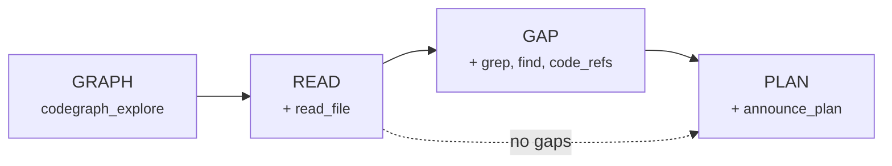

# Astonish Code

`astonish code` turns the Astonish binary into a **local coding tool** — like Claude Code, OpenCode, or Grok CLI. It runs the agent loop **in-process** and executes its built-in tools directly on your machine, in the current directory. No daemon, no server, no login required.

```bash
astonish code                          # Start coding in the current directory
astonish code -m anthropic:claude-4    # Pin a specific model
astonish code -C ./my-project          # Operate in a different directory
astonish code --auto-approve           # Bypass all authorization prompts
```

## Quick Start

```bash
# 1. Install Astonish
brew install SAP/astonish/astonish

# 2. Navigate to your project
cd ~/Projects/my-app

# 3. Start coding
astonish code
```

On first launch, if no model is configured, type `/provider` to add an AI provider (e.g., OpenAI, Anthropic) and `/model` to select a model. Your choice is saved to `~/.config/astonish/config.yaml` and reused next time.

## CLI Flags

| Flag | Short | Description |
|------|-------|-------------|
| `--model` | `-m` | Model to use — bare name or `provider:model` pin |
| `--dir` | `-C` | Working directory (default: current directory) |
| `--resume` | `-r` | Resume an existing session by ID |
| `--auto-approve` | | Auto-approve all tool executions and folder access |
| `--yolo` | | Alias for `--auto-approve` |
| `--debug` | | Enable debug output |

## Operating Modes

Cycle through modes with **`shift+tab`**: Normal → Plan → Graph Plan → Normal.

| Mode | Composer Border | Behavior |
|------|----------------|----------|
| **Normal** | gray | Full tool access with authorization prompts |
| **Plan** | orange | Read-only investigation; produces structured plans without changing files |
| **Graph Plan** | cyan | Codegraph-driven 4-phase planning using a pre-computed knowledge graph |

### Normal Mode

The default operating mode. The agent has full access to all tools — file operations, shell commands, web fetching, browser automation, memory, and more. Non-read-only tools ask for authorization before executing (see [Safety Model](#safety-model)).

### Plan Mode

A read-only investigation mode. The agent can explore your codebase (read files, grep, search memory) but **cannot** write files, run commands, or spawn sub-agents. The runtime gate is enforced server-side — even if the model ignores the instruction, mutating tools are physically blocked.

Use Plan mode when you want the agent to analyze a problem and produce a structured plan (with file lists, blast radius, and verification commands) before making any changes.

### Graph-Optimized Plan Mode

::: tip Standout Feature
Graph-Optimized Plan mode is Astonish Code's most distinctive capability. It produces plans that are **faster** (fewer tool calls), **cheaper** (lower token usage), and **more complete** (full blast-radius coverage) than free-form investigation.
:::

This mode uses [codegraph](https://github.com/colbymchenry/codegraph) — a pre-computed knowledge graph of your repository containing symbols, call edges, dependencies, and blast radius — to drive a **phased planning flow**. Instead of many broad `grep_search` / `find_files` passes, most structural questions resolve in 1–4 codegraph queries.

#### The Four Phases

The agent progresses through four strictly-enforced phases. At each phase, only specific tools are available — the agent physically cannot skip ahead or call tools from a later phase:



| Phase | Tools Unlocked | Purpose |
|-------|---------------|---------|
| **GRAPH** | `codegraph_explore`, `find_files` | Query the knowledge graph. Resolve symbols, call edges, dependencies, and blast radius in 1–4 calls. |
| **READ** | + `read_file`, `read_pdf` | Read exactly the file regions the graph identified — no wasted reads. |
| **GAP** | + `grep_search`, `find_files`, `code_definition`, `code_references`, `repo_map`, `web_fetch`, `memory_search`, `delegate_tasks` | Fill genuine gaps that codegraph structurally cannot answer (e.g., config files, string literals, non-indexed languages). |
| **PLAN** | + `announce_plan` | Record the finalized, dependency-first plan with file lists, verification commands, and parallel-group annotations. |

#### Why It's Efficient

Traditional code investigation follows a pattern like:
1. `grep_search` for a symbol → 15+ results (definitions, references, comments, test mocks)
2. Agent reasons about which are real call sites
3. Another `grep_search` with context to disambiguate
4. `read_file` on 2–3 locations to confirm
5. Repeat for each symbol...

With Graph-Optimized Plan mode:
1. `codegraph_explore("AuthService loginUser session-manager")` → exact definitions, call graph, and blast radius in one call
2. `gplan_reads` → read only the identified regions
3. `announce_plan` → complete dependency-first plan

That's **3 calls instead of 15+** per symbol. Across a planning session resolving 10+ symbols, this saves significant tokens and iteration time.

#### Setup

Graph-Optimized Plan mode requires [codegraph](https://github.com/colbymchenry/codegraph) to be installed:

```bash
# Install codegraph (indexes your repository)
npm install -g codegraph

# Index your project (one-time, ~30 seconds for most repos)
cd your-project
codegraph init
```

Codegraph is registered as a standard MCP server in Astonish — zero configuration needed. If codegraph is not installed or the project isn't indexed, Graph Plan mode gracefully **downgrades to free-form Plan mode** with a notice.

#### Plan Persistence

Plans created via `announce_plan` are written to a per-session `PLAN.md` file that:
- Survives **context compaction** — when the context window fills and old messages are summarized, the plan file persists and the agent can re-read it to resume exactly where it left off.
- Contains a **checkbox per phase** with status (pending/running/complete/failed).
- Records the **concrete blast radius** (affected files marked new/modify/delete), verification commands, and execution details per phase.

## Safety Model

Because code mode runs tools **unsandboxed** on your machine, two authorization gates keep it safe by default:

### 1. Tool-Execution Authorization

Read-only tools (file reading, grep, find, memory search) run freely. Any tool that **writes or executes** — `write_file`, `edit_file`, `shell_command`, `delegate_tasks`, etc. — pauses for your authorization:

- **Allow** — authorize this single execution
- **Always Allow** — authorize all tools for the rest of the session
- **Deny** — block the call; the agent self-corrects

### 2. Folder-Access Authorization

By default, tools may only touch the **project working directory** and its subtree. Any path outside the project root (including paths inside shell commands like `cat ~/Downloads/x`) triggers a second prompt:

- **Allow** — authorize this single access
- **Always Allow** — authorize this directory for the session
- **Deny** — the agent stays in-project

### Bypassing Authorization

```bash
astonish code --auto-approve    # Skip all prompts (a.k.a. --yolo)
```

Use this for trusted tasks where you don't want to be interrupted. The agent still operates in the working directory by default.

## Project Guidance (AGENTS.md)

Code mode follows the [AGENTS.md](https://agents.md) convention: on startup it loads project instructions into the system prompt.

**Loading order** (root-first, nearest file highest precedence):

1. Global `~/.config/astonish/AGENTS.md` (lowest precedence)
2. Repository root `AGENTS.md`
3. Subdirectory `AGENTS.md` files walking down to the working directory (highest precedence)

Falls back to `CLAUDE.md` when a directory has no `AGENTS.md`. This means your existing Claude Code project instructions work out of the box.

Use AGENTS.md to teach the agent your project's:
- Build/test/lint commands
- Code conventions and naming
- Architecture constraints
- Directory structure guidance

## Sessions

Sessions are **saved to disk** and **scoped per project directory**. Each project keeps its own conversation history — sessions from other directories never appear.

| Action | How |
|--------|-----|
| Start fresh | `astonish code` (always starts a new session) |
| Browse history | `/sessions` or `ctrl+l` inside the app |
| Resume by ID | `astonish code --resume <session-id>` |
| New mid-conversation | `/new` or `ctrl+n` |
| Delete | Press `d` in the sessions picker |

Sessions survive restarts and are stored at `~/.local/share/astonish/sessions/code/`.

## Rollback

`/rollback` reverts **both** the conversation and any file changes back to an earlier user message.

```
/rollback
```

The picker shows each of your messages with the number of files that would be restored. Select a point and confirm — the conversation is truncated and all file modifications after that point are undone.

::: info
Rollback is code-mode only. It uses snapshot-on-write (files are captured before each tool modifies them) and transcript truncation.
:::

## Dual-Backend Switching

When logged in to a platform (`astonish login <url>`), press **`Ctrl+\`** to switch between:

| Mode | Accent Color | Backend |
|------|-------------|---------|
| **Code** | Orange/amber | Local in-process agent (your machine) |
| **Platform** | Blue/cyan | Platform agent (remote, sandboxed) |

Each mode maintains its own session, transcript, and plan state independently. The UI color accent changes instantly so you always know which mode you're in.

This lets you:
- Use code mode for local development tasks
- Switch to platform mode for team memory, fleet orchestration, or sandboxed execution
- Switch back without losing your place in either conversation

## Provider Management

### `/model`

Open a two-step picker to choose provider → model. Your selection is saved to config and reused next time.

### `/provider`

Add, list, or remove AI provider instances. Supports all Astonish providers: OpenAI, Anthropic, Google Gemini, Groq, xAI, OpenRouter, SAP AI Core, LiteLLM, Ollama, LM Studio, and more.

```
/provider          # Open the provider management overlay
```

Provider configuration is purely file-based (`~/.config/astonish/config.yaml`) — no database needed.

## MCP Tools

MCP servers configured in your `config.yaml` are **first-class** in code mode — every tool is callable by its bare name without a discovery step. This matches the personal, few-servers reality of a coding session.

```yaml
# ~/.config/astonish/config.yaml
mcp_servers:
  github:
    command: "npx"
    args: ["-y", "@modelcontextprotocol/server-github"]
    env:
      GITHUB_PERSONAL_ACCESS_TOKEN: "ghp_..."
```

After configuration, call MCP tools directly: `create_issue`, `search_repositories`, etc.

## In-Session Commands

| Command | Description |
|---------|-------------|
| `/help` | Show available commands |
| `/new` | Start a fresh conversation |
| `/sessions` | Browse and resume previous sessions |
| `/model` | Choose provider and model |
| `/provider` | Add/remove AI provider instances |
| `/plan` | Toggle Plan mode (same as `shift+tab`) |
| `/rollback` | Revert conversation and file changes |
| `/compact` | Trigger context compaction immediately |
| `/distill` | Distill the session into a reusable flow |
| `/status` | Show session info, provider, model, and context usage |

## Context Management

The header shows real-time **context utilization**: `Context <used>/<window> (<pct>%)`. When the context window fills:

- **Automatic compaction** creates a summary of older messages while preserving recent context and any active plan.
- **Manual `/compact`** forces compaction immediately.
- **Plan persistence** ensures your `PLAN.md` survives compaction — the agent re-reads it and resumes exactly where it left off.

## Native Prerequisites

Astonish Code auto-provisions its native dependencies:

- **Tree-sitter** (for `code_definition`, `code_references`, `repo_map`) — compiled from embedded C sources and cached on first use. Requires a C compiler (Xcode Command Line Tools on macOS).
- **ripgrep** (for `grep_search`) — auto-downloaded from the official release if not on PATH. SHA256-verified.

Both light up automatically after a one-time setup on first use.

## Examples

```bash
# Basic coding session
astonish code

# Work on a specific project with a pinned model
astonish code -C ~/Projects/my-api -m openai:gpt-4o

# Trusted automation (no prompts)
astonish code --yolo

# Resume where you left off
astonish code --resume abc123

# Debug mode (logs to ~/.config/astonish/code-debug.log)
astonish code --debug
```

## Tips

- Use **Graph Plan mode** (`shift+tab` twice) before large refactors — it produces complete, dependency-aware plans with blast-radius coverage.
- Use **`@filename`** in the composer to attach file content to your message without manually pasting.
- Press **`ctrl+o`** to expand/collapse the latest tool activity block.
- **Drag to select** text in the transcript and it's automatically copied to your clipboard.
- **Image paste** works — `Ctrl+V` an image and multimodal models will see it.
